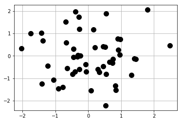

```python
import numpy as np
import matplotlib.pyplot as plt
%matplotlib inline
```

## 生成数据


```python
np.random.seed(777)
data = np.random.normal(0, 1, size=100).reshape(50, 2)
x = data[:, 0]
y = data[:, 1]
```

## 基本画图


```python
plt.plot(x, y, 'ko', markersize=10)
plt.grid()       # 虚线
plt.show(True)   # block = True
```





## x, y轴等刻度


```python
def get_new_ax():
    plt.clf()
    ax = plt.gca()
    plt.grid()
    return ax

ax = get_new_ax()
ax.set_xlim(-4, 4)
ax.set_ylim(-4, 4)
ax.set_aspect('equal', 'box')
ax.plot(x, y, 'ko', ms=10)  # ms: markersize
plt.show()
```


```python
np.repeat([0, 1, 2, 3, 4, 5], 6)[::-1]
```


    array([5, 5, 5, 5, 5, 5, 4, 4, 4, 4, 4, 4, 3, 3, 3, 3, 3, 3, 2, 2, 2, 2, 2,
           2, 1, 1, 1, 1, 1, 1, 0, 0, 0, 0, 0, 0])


```python
np.array([list(range(6))[::-1] for _ in range(6)]).reshape(-1)
```


    array([5, 4, 3, 2, 1, 0, 5, 4, 3, 2, 1, 0, 5, 4, 3, 2, 1, 0, 5, 4, 3, 2, 1,
           0, 5, 4, 3, 2, 1, 0, 5, 4, 3, 2, 1, 0])


## 散点图


```python
ax = get_new_ax()

ax.scatter(
    x, y,
    s=[40 + 4 * i for i in range(len(x))],     # size, scalar or number
    c=['r', 'g'],   # color 
    marker='o', 
    alpha=0.5,
    # facecolors='none',   # 不能与c混用
    edgecolors='none',
)
plt.show()
```


```python
ax = get_new_ax()

ax.scatter(
    x, y,
    s=80,
    facecolors='none',
    edgecolors=['r', 'b'],
)
plt.show()
```


## [常用maker](https://matplotlib.org/api/markers_api.html#matplotlib.markers.MarkerStyle)


```python
ax = get_new_ax()

# x = np.linspace(0, 1, 36)
# y = np.arange(0, 1, 1/36)
x1 = np.repeat(np.arange(1, 6.1), 6)
y1 = np.array([list(range(6))[::-1] for _ in range(6)]).reshape(-1)
markers = [
    "." ,	# point
    "," ,	# pixel
    "o" ,	# circle
    "v" ,	# triangle_down
    "^" ,	# triangle_up
    "<" ,	# triangle_left
    ">" ,	# triangle_right
    "1" ,	# tri_down
    "2" ,	# tri_up
    "3" ,	# tri_left
    "4" ,	# tri_right
    "8" ,	# octagon
    "s" ,	# square
    "p" ,	# pentagon
    "p" ,	# plus (filled), Unrecognized marker style P
    "*" ,	# star
    "h" ,	# hexagon1
    "H" ,	# hexagon2
    "+" ,	# plus
    "x" ,	# x
    "x" ,	# x (filled), X unrecognized
    "D" ,	# diamond
    "d" ,	# thin_diamond
    "|" ,	# vline
    "_" ,	# hline
    "None" , # " " or "" 	nothing
    '$\sum{(a + b)}$', # 	render the string using mathtext.    
]
for ix, m in enumerate(markers):
    ax.scatter(x1[ix], y1[ix], s=100, c='r', marker=m)
plt.show()
```


## 圆


```python
ax = get_new_ax()

ax.scatter(x, y, s=60, c='k', alpha=0.5, marker='o')

ax.set_xlim(-3, 3)
ax.set_ylim(-3, 3)
ax.set_aspect('equal', 'box')
c = plt.Circle(xy=(0, 0), radius=1.5, color='b', alpha=0.2)
ax.add_artist(c)
c = plt.Circle(xy=(0, 0), radius=2.5, color='r', alpha=0.2)
ax.add_artist(c)

plt.show()
```


