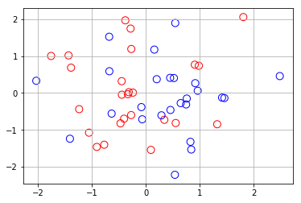
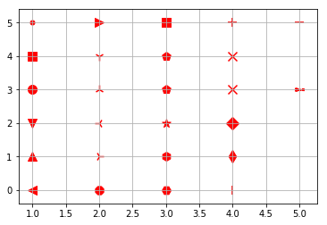
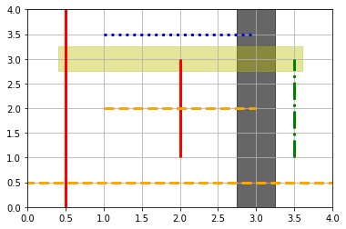
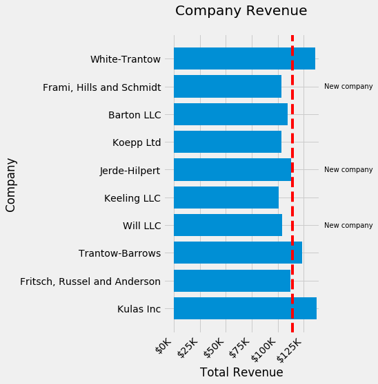

```python
import numpy as np
import pandas as pd
import matplotlib as mpl
import matplotlib.pyplot as plt
import matplotlib.image as mpimg
import warnings
from matplotlib.ticker import FuncFormatter

warnings.simplefilter('ignore', UserWarning)

plt.rcParams.update(plt.rcParamsDefault)
%matplotlib inline 
# inline
# plt.style.use('fivethirtyeight')

dpi = 150
mpl.rcParams['figure.dpi'] = dpi  # inline display, 150 - 300
mpl.rc("savefig", dpi=dpi)
mpl.rcParams['figure.figsize'] = (4,3)   # default, 指定图片大小，否则设置dpi之后图片可能较大

print(mpl.__version__)
```

    2.2.2


## 生成数据


```python
np.random.seed(777)
data = np.random.normal(0, 1, size=100).reshape(50, 2)
x = data[:, 0]
y = data[:, 1]
```

## 基本画图


```python
plt.plot(x, y, 'ko', markersize=10)
plt.grid()       # 虚线
plt.show(True)   # block = True
```


## x, y轴等刻度


```python
def get_new_ax():
    plt.clf()
    ax = plt.gca()
    plt.grid()
    return ax

ax = get_new_ax()
ax.set_xlim(-4, 4)
ax.set_ylim(-4, 4)
ax.set_aspect('equal', 'box')
ax.plot(x, y, 'ko', ms=10)  # ms: markersize
plt.show()
```


## 多图比较

### 1. 多窗口


```python
data = np.arange(100, 201)
plt.plot(data)

data2 = np.arange(200, 301)
plt.figure()
plt.plot(data2)

plt.show()
```


### 2. 多子图


```python
# plt.subplot(2, 1, 1)   # 2 rows, 1 col, and first figure
plt.subplot(211)         # same above
plt.plot(data)
# plt.subplot(2, 1, 2)   # 2 rows, 1 col, and second figure
plt.subplot(212)         # same above
plt.plot(data2)
plt.show()
```


## [散点图](https://matplotlib.org/api/_as_gen/matplotlib.pyplot.scatter.html#matplotlib.pyplot.scatter)


```python
np.repeat([0, 1, 2, 3, 4, 5], 6)[::-1]
```


    array([5, 5, 5, 5, 5, 5, 4, 4, 4, 4, 4, 4, 3, 3, 3, 3, 3, 3, 2, 2, 2, 2, 2,
           2, 1, 1, 1, 1, 1, 1, 0, 0, 0, 0, 0, 0])


```python
np.array([list(range(6))[::-1] for _ in range(6)]).reshape(-1)
```


    array([5, 4, 3, 2, 1, 0, 5, 4, 3, 2, 1, 0, 5, 4, 3, 2, 1, 0, 5, 4, 3, 2, 1,
           0, 5, 4, 3, 2, 1, 0, 5, 4, 3, 2, 1, 0])


```python
ax = get_new_ax()

ax.scatter(
    x, y,
    s=[40 + 4 * i for i in range(len(x))],     # size, scalar or number
    c=['r', 'g'],   # color 
    marker='o', 
    alpha=0.5,
    # facecolors='none',   # 不能与c混用
    edgecolors='none',
)
plt.show()
```


```python
ax = get_new_ax()

ax.scatter(
    x, y,
    s=80,
    facecolors='none',
    edgecolors=['r', 'b'],
)
plt.show()
```





## [常用maker](https://matplotlib.org/api/markers_api.html#matplotlib.markers.MarkerStyle)


```python
ax = get_new_ax()

# x = np.linspace(0, 1, 36)
# y = np.arange(0, 1, 1/36)
x1 = np.repeat(np.arange(1, 6.1), 6)
y1 = np.array([list(range(6))[::-1] for _ in range(6)]).reshape(-1)
markers = [
    "." ,	# point
    "," ,	# pixel
    "o" ,	# circle
    "v" ,	# triangle_down
    "^" ,	# triangle_up
    "<" ,	# triangle_left
    ">" ,	# triangle_right
    "1" ,	# tri_down
    "2" ,	# tri_up
    "3" ,	# tri_left
    "4" ,	# tri_right
    "8" ,	# octagon
    "s" ,	# square
    "p" ,	# pentagon
    "p" ,	# plus (filled), Unrecognized marker style P
    "*" ,	# star
    "h" ,	# hexagon1
    "H" ,	# hexagon2
    "+" ,	# plus
    "x" ,	# x
    "x" ,	# x (filled), X unrecognized
    "D" ,	# diamond
    "d" ,	# thin_diamond
    "|" ,	# vline
    "_" ,	# hline
    "None" , # " " or "" 	nothing
    '$\sum{(a + b)}$', # 	render the string using mathtext.    
]
for ix, m in enumerate(markers):
    ax.scatter(x1[ix], y1[ix], s=100, c='r', marker=m)
plt.show()
```





## [线图](https://matplotlib.org/api/_as_gen/matplotlib.pyplot.plot.html#matplotlib.pyplot.plot)

第三个参数fmt的格式为

```fmt = '[color][marker][line]'```

**color:**

| character | color |
| --------- |:-----:| 
| 'b'	| blue     |
| 'g'	| green    | 
| 'r'	| red      |
| 'c'	| cyan     |  
| 'm'	| magenta  | 
| 'y'	| yellow   |  
| 'k'	| black    | 
| 'w'	| white    |  

**line styles**

character | description
:------  | :---------
'-'	    |  solid line style
'--'	|  dashed line style
'-.'	|  dash-dot line style
':'	    |  dotted line style


```python
def f(t):
    return np.exp(-t) * np.cos(2*np.pi*t)


def s(t):
    return 1 / (1 + np.exp(-t))

x = np.arange(0.0, 5.0, 0.2)
y = f(x)

ax = get_new_ax()
plt.set_cmap('PRGn')
ax.plot(x, y, 'purple', linewidth=3)        # plot 即是画线的接口
ax.plot(x, s(x), 'bo-', linewidth=1)        # 点线结合 o -> marker, "-" or "--" -> linestyle
plt.show()
```


```python
ax = get_new_ax()

ax.set_xlim(0, 4)
ax.set_ylim(0, 4)
plt.set_cmap('Spectral')
ax.vlines(x=2, ymin=1, ymax=3, colors='red', linestyles='solid', linewidth=3)
ax.vlines(x=0.5, ymin=-1, ymax=5, colors='red', linestyles='solid', linewidth=3)
ax.hlines(y=2, xmin=1, xmax=3, colors='orange', linestyles='dashed', linewidth=3)
ax.hlines(y=0.5, xmin=-1, xmax=5, colors='orange', linestyles='dashed', linewidth=3)

# min, max 按照[0, 1]的比例，而不是真实刻度
ax.axvline(x=3.5, ymin=0.25, ymax=0.75, c="green", linestyle='dashdot', linewidth=3)
ax.axhline(y=3.5, xmin=0.25, xmax=0.75, c="blue", linestyle='dotted', linewidth=3)

# span rectangle
ax.axvspan(xmin=2.75, xmax=3.25, ymin=0, ymax=1, color="k", alpha=.6)
ax.axhspan(ymin=2.75, ymax=3.25, xmin=0.1, xmax=0.9, color="y", alpha=.4)

plt.show()
```





## [柱状图](https://matplotlib.org/api/_as_gen/matplotlib.pyplot.bar.html#matplotlib.pyplot.bar)


```python
N = 5
menMeans = (20, 35, 30, 35, 27)
womenMeans = (25, 32, 34, 20, 25)
menStd = (2, 3, 4, 1, 2)
womenStd = (3, 5, 2, 3, 3)

ind = np.arange(N)
width = 0.35
b1 = plt.bar(ind, menMeans, width, yerr=menStd)
b2 = plt.bar(ind+width, womenMeans, width, yerr=womenStd)

# reset xticks and labels
plt.xticks(ind+width*0.5, ('G1', 'G2', 'G3', 'G4', 'G5'))
plt.yticks(np.arange(0, 51, 10))

# add legend
plt.legend((b1[0], b2[0]), ('Men', 'Women'))

plt.show()
```


```python
p1 = plt.bar(ind, menMeans, width, yerr=menStd)
p2 = plt.bar(ind, womenMeans, width,
             bottom=menMeans, yerr=womenStd)

plt.ylabel('Scores')
plt.title('Scores by group and gender')
plt.xticks(ind, ('G1', 'G2', 'G3', 'G4', 'G5'))
plt.yticks(np.arange(0, 81, 10))
plt.legend((p1[0], p2[0]), ('Men', 'Women'))

plt.show()
```


## [boxplot](https://matplotlib.org/api/_as_gen/matplotlib.pyplot.boxplot.html#matplotlib.pyplot.boxplot)


```python
x = np.random.random(size=5000)
ax = plt.gca()
ax.set_ylim(-0.1, 1.1)
plt.boxplot(x, 
            notch=True,        # represent the confidence interval around the median
            sym='ko',            # outlier显示方式
            vert=True,          # 水平或是垂直展示
            whis=[1, 99],         # float, Q3 - whis*IQR, Q3 + whis*IQR, 'range' -> full, [] -> 1 percentage
            widths=[0.3],
            labels=['demo'],
            # 是否展示均值线
            showmeans=True,
            meanline=True,
            
            # 调整更细致的属性
            capprops = {'linewidth': 2, 'color': 'k'},
            boxprops = {'linewidth': 2, 'color': 'r', },
            whiskerprops = {'linewidth': 2, 'color': 'g'},
            flierprops = {'markersize': 5, 'alpha': 0.3, 'color': 'b'},    # alpha, color not help
            medianprops ={},
            meanprops={}
            
           )
plt.show()
```


```python
x1 = np.random.random(size=5000)
x2 = np.random.random(size=5000)
ax = plt.gca()
ax.set_ylim(-0.1, 1.1)
bp = plt.boxplot([x1, x2], labels=['X1', 'X2'],
                 widths=[.5, .5],
                 boxprops = {'color': 'none'},
                 patch_artist=True)   # fill with color

colors = ['lightgreen', 'lightblue']
for patch, color in zip(bp['boxes'], colors):
    patch.set_facecolor(color)

plt.show()
```


## [饼图](https://matplotlib.org/api/_as_gen/matplotlib.pyplot.pie.html#matplotlib.pyplot.pie)


```python
labels = 'Frogs', 'Hogs', 'Dogs', 'Logs'
fracs = [15, 30, 45, 10]

ax = plt.gca()
ax.set_aspect('equal')      # to make square figures and axies
plt.pie(fracs, labels=labels)

plt.show()
```


```python
explode = (0, 0.05, 0, 0)
the_grid = plt.GridSpec(2, 2)

plt.subplot(the_grid[0, 0])
plt.pie(fracs, labels=labels)

plt.subplot(the_grid[0, 1], aspect=1)
plt.pie(fracs, labels=labels, autopct='%.1f%%', shadow=True)

plt.subplot(the_grid[1, 0], aspect=1)
plt.pie(fracs, explode=explode, labels=labels, autopct='%.0f%%', shadow=True)

plt.subplot(the_grid[1, 1], aspect=1)
patches, texts, autotexts = plt.pie(fracs, labels=labels, 
                                    explode=(0, 0, .1, 0),
                                    autopct='%.0f%%', shadow=True, 
                                    radius=.7)    # 减小figure 大小
for t in texts:
    t.set_size('smaller')       # 外层字符

for t in autotexts:             # 内层数据字符
    t.set_size('x-small')
    
autotexts[2].set_color('w')     # 选择数据设置颜色

plt.show()
```


## [直方图](https://matplotlib.org/api/_as_gen/matplotlib.pyplot.hist.html#matplotlib.pyplot.hist)


```python
x = np.random.normal(3, 2, size=5000)

plt.subplot(211)
plt.hist(x, bins=20, 
         range=(-1, 5),
        )
plt.grid()
plt.subplot(212)
plt.hist(x, bins=50, edgecolor='m',
         density=True, histtype='step',   # 'bar', 'barstacked', 'step', 'stepfilled'
         orientation='vertical',        # horizontal, vertical
        )
plt.show()
```


## 圆


```python
data = np.random.normal(0, 1, size=100).reshape(50, 2)
x = data[:, 0]
y = data[:, 1]

ax = get_new_ax()

ax.scatter(x, y, s=60, c='k', alpha=0.5, marker='o')

ax.set_xlim(-3, 3)
ax.set_ylim(-3, 3)
ax.set_aspect('equal', 'box')
c = plt.Circle(xy=(0, 0), radius=1.5, color='b', alpha=0.2)
ax.add_artist(c)
c = plt.Circle(xy=(0, 0), radius=2.5, color='r', alpha=0.2)
ax.add_artist(c)

plt.show()
```


## 日期类数据


```python
x = pd.date_range('20170101', '20170201')
y = np.sin(np.arange(len(x)))

from matplotlib.dates import DateFormatter, RRuleLocator, rrulewrapper, DAILY

fig, ax = plt.subplots()
plt.plot_date(x, y, 'mo-')

formatter = DateFormatter('%Y%m%d')
ax.xaxis.set_major_formatter(formatter)
ax.xaxis.set_tick_params(rotation=30, labelsize=8)

rule = rrulewrapper(DAILY, interval=5)      # wrapper of dateutil.rrule
loc = RRuleLocator(rule)
ax.xaxis.set_major_locator(loc)

plt.show()
```


## 动态更新


```python
from matplotlib.animation import FuncAnimation
from IPython.display import HTML
from matplotlib import animation, rc

fig, ax = plt.subplots()
xdata, ydata = [], []
ln, = plt.plot([], [], 'ro', animated=True)

def init():
    ax.set_xlim(0, 2*np.pi)
    ax.set_ylim(-1, 1)
    return ln,

def update(frame):
    xdata.append(frame)
    ydata.append(np.sin(frame))
    ln.set_data(xdata, ydata)
    return ln,

ani = FuncAnimation(fig, update, frames=np.linspace(0, 2*np.pi, 128),
                    init_func=init, blit=True)

# plt.show()
# HTML(ani.to_html5_video())
# print("Done")
rc('animation', html='html5')
plt.close(ani._fig)     # 避免画最后的图像
ani
```


<video width="900" height="600" controls autoplay loop>
  <source type="video/mp4" src="data:video/mp4;base64,AAAAHGZ0eXBNNFYgAAACAGlzb21pc28yYXZjMQAAAAhmcmVlAABXQW1kYXQAAAKtBgX//6ncRem9
5tlIt5Ys2CDZI+7veDI2NCAtIGNvcmUgMTQ4IHIyNjQzIDVjNjU3MDQgLSBILjI2NC9NUEVHLTQg
QVZDIGNvZGVjIC0gQ29weWxlZnQgMjAwMy0yMDE1IC0gaHR0cDovL3d3dy52aWRlb2xhbi5vcmcv
eDI2NC5odG1sIC0gb3B0aW9uczogY2FiYWM9MSByZWY9MyBkZWJsb2NrPTE6MDowIGFuYWx5c2U9
MHgzOjB4MTEzIG1lPWhleCBzdWJtZT03IHBzeT0xIHBzeV9yZD0xLjAwOjAuMDAgbWl4ZWRfcmVm
PTEgbWVfcmFuZ2U9MTYgY2hyb21hX21lPTEgdHJlbGxpcz0xIDh4OGRjdD0xIGNxbT0wIGRlYWR6
b25lPTIxLDExIGZhc3RfcHNraXA9MSBjaHJvbWFfcXBfb2Zmc2V0PS0yIHRocmVhZHM9MSBsb29r
YWhlYWRfdGhyZWFkcz0xIHNsaWNlZF90aHJlYWRzPTAgbnI9MCBkZWNpbWF0ZT0xIGludGVybGFj
ZWQ9MCBibHVyYXlfY29tcGF0PTAgY29uc3RyYWluZWRfaW50cmE9MCBiZnJhbWVzPTMgYl9weXJh
bWlkPTIgYl9hZGFwdD0xIGJfYmlhcz0wIGRpcmVjdD0xIHdlaWdodGI9MSBvcGVuX2dvcD0wIHdl
aWdodHA9MiBrZXlpbnQ9MjUwIGtleWludF9taW49NSBzY2VuZWN1dD00MCBpbnRyYV9yZWZyZXNo
PTAgcmNfbG9va2FoZWFkPTQwIHJjPWNyZiBtYnRyZWU9MSBjcmY9MjMuMCBxY29tcD0wLjYwIHFw
bWluPTAgcXBtYXg9NjkgcXBzdGVwPTQgaXBfcmF0aW89MS40MCBhcT0xOjEuMDAAgAAAFtFliIQA
E//+97GPgU3IAA2XOop6H+EVsfSQUXqx2aBk6gAAAwAAAwAAAwAAEEvHgX6608+vpEAAAAMAKGAD
IAD4RDwov6zHmAId9xlQoz/Sf7zFZi5QUXWQdebrWrgHGwf6qfO2GEEwoKXou6iwSO0AzE0xsisp
c6HJlK+WTO6+FmSMBRiOp+mg6nE0BvykwHYh5nwC5fl8tBC5AF1TwjsxKjm+eBZQlt+KL4PRDJLg
zv30PwFRYWA84YmR5nji+j/USiF1hU7fFiyddIhHtMRU3IF0oVS+ENbmj4MqEkJzuKRFitpEdMO2
W7lmfKVOnxwfB226BwSuolk0RMJFyEn0hrAY6kMv9mf03WNO7HOWOcrJdMxGSvScTH1CL2CNxVUV
pGrLw5R2TodxL4md3pgGDb6v9pt6okN1D6iWlRrFdbzPaVsPxHEnb7EVT4cJA1Dj79Q4yGDyGNMm
5HYn7uZotYicWmste5hzwQ2BauhPe+gAEDpRcVKw8WrkFcAXhWe83TG3b1jxQAw540el/eikVtp4
uycqHe5DMjNG42PhqRKlLl3WpcPlXd3bZzfzCGAA0b1TQSgIoQtCJJxiGWOYno73Lghhc0CIRsx8
kaXX6esqRM3Te098h/Khh86b3YAABmmAHFC2vxxnhGr8VSr+qVPGG0D6R6VLDpkPaH3hf9Abwvvv
EP5z9ein5ubYDoUJBs8CH6lE6T+ucfysr/6Sd0u2oDaTnJvs4XuNuI5XiwMYdrdhNoj4Xty2vJUX
fmUErL2cMtaqwZ3zb9bn6vd0x7pLrxmytABF+V1LDIqoZ6jNTm3vwldWmun5VkPmWsUcqOzri9DK
E6r5DqPzKyl8tS58rhbPeAptjoRolfEco87OCaCIFSv4c4NBJRlKu6dLxhRp3ai3xeJKQSiE31Ko
9AjoACvAihGvhuACkn67Y3pWKkmF8KKC+3jnZAik9K9NpG1JIlZp7AQZvxKWjMHTcYm49aAebyiM
2sRhfXH6O60Qyrbp56hQavudNxp501n+2UgNSGJFaetKw2vn0s9147TJkn6sCqr8WZc/00xJgQQa
5G1SgbXMdKZwafJZMY19MuGGjGxkEjOLmCFEiC2ZjN5AMGbx2rbGbCH7dr8oECGkj5DK9OufHysY
NY/Q6UOvzGnQ0zaSR/LWlONWjbxQJh9kVKNVBP9SLyDeRsp1tLZzwza0XbOMP91XyHjWdCpgKEDj
t266e9ntcYIylMkEKBQNW0wPfufeLhSGvsoTcfMhnNfOKPxNETHN7G/REShHhViFtt4tnEVUqvLg
QCt7hyH6osA/9/iRWRWCzmahwmzARXFMYMm5gAKb5NhALIBBWyxXPnnseSVGovpMHBzcid+9V2II
Fxc76+Pmmy7522KXlmBUZKmhA36rvHv4pDGxutHspl0FrYeVnG3jSvNb6fLaCaOLH/vlykrxF6Sz
NpTdes1P1Exodbgb37AA9urxY8j+YrCHvArgO5JCj5NGwB+oH26RkOeXQLYZSRmaG24dTjBzr8nw
0+vn5407YTJ9QYbEJV04I75qIzEpqyRHjIBtuOrtYMOgdzI0T8jLCFxln0MiyAhrOn70LAENTHTe
mFnrgMW3uI0pBwm4Tj1e36irp4V3PG4HZJzRsyDHC+5Kdw9sqWEdwr5K0O8TJE4PY6rezHMMBhHz
Dulk3NGorvgKlXwpq6vrhENonW/8XB00vEeann1rqotkAcGx/7nAUKShpA6wXw6muV55+vXU+5+g
wxhh1Cz1TgsNf+r1wUllLVgIyRtcn5R0vfs9WzfNlERP2yj1zITkWmWD1mp6zMMETcNI/XGCW1xF
fezSFNbyLMmYXvmK5hoKxWPfBOEuVzm0Ze4MGK5/+vd/YJHOc5TjbkyGeXMBUAdFktp0IZsZy4+1
aCrFb0C97JNGhFLfYkz7MKeBK4e4eou47rOM3xN5nOD8PFOg5HTA9SJEGMXdhtgRL2+yEVk3wEfY
Iyh8oHM1V9TVbFwVnRwjWFfk3DiTdqNt1npGnregYZtOzilJaAAWQAZEJ1H9nO9ciguXidoeMFpp
6cBXa8APagCIQk+aqqN2krloYUYbEnp/RwM/ENXprtOsZPQCbPUSj8hDqY1XW4Jdk8FQwDaZ0aTf
5mj6XrL3IWwBYoflQZy2v6B7F+EpcbnGt+rTtPW6XzEz8oAJbWdO9eIo3rdTssNuelX5VkcCYeyl
ojC9wOmSNxqsOCUK92QagZN5ZnbTSkVcUc2FyplkxK6VguSrAnRSDXC57bUvBocs/R/riHFXbqlT
rxHr5abKBynbzyl6x3DrDMgABfQTwwanYAm/B/0XZlzvddWdA6ddSHrBZuYDd/sFToz3J4GmvfsU
GiQ7Gz5S2jRyeyCMh1mCjMpvTZx61UpuEF97zJ8lOCt9HW0325WJvZn/HsVaZQmmlZCQ+bI/dbEp
3QPnbltKfSzVxWQQ16SG8PoYwP2/BCK95OlzE3lbpKJD7AgA3aBVox+TK/ibvh9LhxvsEkl9OHmG
QrLdDzZlwYBCoQhnLMbOcems4dRQzUzK/8MiHkhTAFpeIiVLAI5putQZrwmjBcya83Njct8k/xUA
vakNCju0dinaR01FG+8Y+jWTPgD744B4A/e8m4JblBx4j43vVo1vciCC8eHgU8zdFGePbNeoQc7b
V4YA+GgWiJPz645/Vj4A9hf4LRhXfRCz9teilZnfUOB+gAARgXQtrD81Q4WpZua/O1zfGnZOvZy1
Qa5dCAAAAwAAAwAWpyfVFk5Mc8og3bLoFNDMfyWY3ALa/nY2lGjfK4FDgjLbCu0ttWeQKkVfLjzR
2zvCxeLgH2NnG7EhnqrfICGeS+N6Wmy4ZhMwQ5/rF/JgKijPYtn74pwsjCbDJolSnLS0xFdfrJkA
IRDnmXQAqkYK/Ob2DTNlV6VJ4JMRkTf5BVcY5bMySJqHioYCf7TyvZp1DpiTgRe14KbyTNs58brl
UyGtHwOaiuDPTcOfpQfNsXn+gNOWMvHuyiwZhtAqrP0MjM27dC2hCEMB2WdLK8j1p2/PB519fuae
QGl5gIlGh64JTN/lK4ayeBHISeFNESwX4Q37HM3/8hvXpa+Pplcg1cNPfT+dewIJ368WIyyG1Mf2
uAMlR3U9opOtMzK4EODgH1ajZok9YOL5zS43j2tJ46nnvbNnhFzCCN9mA/txrKEEqFDznkjYFC9q
WUeNRRmUKdbUJwDg4/a9aXaasAzTR81chjQRGAvfq71PuBlEQo3t1sCYFXKaXzo63oUJNGLXnNJl
ZUOFUbLeT/aHRayQ7vjL4242dk61FgZV1rn8UREt5K8+/mCUSdG0naj2MfUhAC5Cka9eYBc7W7BZ
8ASq0jfUXpyzHso7Y6tsHLaF1ZnlApXARtsBlX4Mq1Oc6hZcOYc/Ic5afPuqjou6xELrWEPuNNhN
Px6X9yYKncdQtaxqUZfYrFY8Q3RKv2YJR+yCPR8k4DVPMXVOU/J8JK9vlSJKq3ByqVh3p6eAi/o1
EQtfBMAIPJvPUvk6rs+3Qh5D626hHCTQBQP6aAp5vhQfBCxZs1kwDzBaQ2I3c5XI+3kjBMEDXV/M
ZuvChq/i1Wf706Pi4FuuQtOER/vf03kACZFf7t3oQIBALmhGhMBuq3wuw2ocDFaKiGV5o4kRVFCV
tVNd1IOogMxR5gm0Q9f0PWGoynGHvK36anDpxgBjYigEIgBqmG06wh4ecNV9KU1mzREVUzkhfkDU
Di6CkSOYNpv/Remb38VbQ6qeCsywdFPv4U8GezMHdeTt2xkvisG3bjTW8ox1xFf+svYLZRbiX77a
TGah/O43zLu2Tv3onAdhKhGFWeGrrmTUM//xhPq5hMLb/z8Bh/LJyLsoDqMAAVGn2TbNUsYsgmAg
goGlV54wfZiKUI2VBqUkCeo5XkN5J3LuVpvOnyQAIfFP9p0KUyN2KWm4O6SlGGwIkM2FcN8EcyF4
gZZmfp5ytW1+dwMc52c6PxVFYizuBGbo2n83XvoFBiRE4EYAFGxDfsUqhng87+4VBjA2o7YsHPds
JeeuD+HCFWM3vuxt6hPN9dAVv97dtOTX/oxyaJXrIvqWJbZ9Bau2lXNA9PBV1CIZRiIEQMK7CFy+
dPtpf+ss0EjdrUQaMhMXt55nqQpK5n/9L9w/9i4NFk1qIEphDMnSu9lunDPIGn3b0+QjSKPrMZtC
0U8Erno8+YWD0y+K4U5lGXRKgrBZUI2I2+KevraEpuWMhFWdzAnYwy34eNt6o/7Np6EfLlG6Rkbk
K0rFZSWtkWVR+jfYQqi/0ngOQ9unLWw/0OaSmfLD0sA+nTiRciLYOtqb+YpULrsAAAMAAAMAAFCa
kO7Y3Y4hVqstiochGbMuZbXeU45ififVEwRgR2C7zMbvJpazFMck27RYVJO4keXBhMPS4w08LLFc
e6AUaPxUGBtdFLzQl7CxnVUrzX5+vqa11EJfiNoqbxPqfcMN6e/Gn/yqQ6gZBUvaPuxLP/3T6Wr8
0b7xr7VNAkg9Syv5XfsA7I6V4BbEpnBnLaEZU98oqwNUvKkDNO+9t8faJgNcyEghw/gQntlYviJ9
rJngIAMighJkDtC1WrKGjFwJnpSVhRI+64mhtjdefG0VsaxsdL9i2o2eUW7XG4/PfcRsqoTg+lE2
NOe9LqQ8huAdAnsyPGBeeuivUjCCVqxo47YX8Bdk4GDkCgQ4MtPWVzaKxZNXcVklQU6XdbuLkHwf
Fvlg8iIZJaSUVpzWsU/0BO0x0Nh2i2gAk335PO5ecHkkYSjSfvJKtKElEq9Z16BnJwkkd7fzWIi+
NU/HHURNLRMkhe49I2Ma6NvhbxfK+kqQ9klM32zWVgy8+MprAcQEkAWQ/Y4Mo5ufMgfZylzDD/CR
bOUZSug0gQXRhKLGEd8dI7y+hzhNCM5O0TCXKiu9gjSycGHGYLkrdhi22dIQM2bXgF8X1bDuVY9A
AAADAHIFtgd9zi3Vk93Al76Edxqv4vvBuZsX24qLz3GQCnRBGH0mCVcv67QNDiLf4kY/5Da4ns2A
Ets3brC9NJl807V8UCXW2LKbOTRrKEmAvArobVPzBXjdZ/XHlW4a6+dEvnxGdf/++joqUj2RILHt
IGacnSBwKsgQADUd+Ng3tER/twIhcGvh1/aYbcCvMzfWYnFfDfoF8UMgC6JtnhmGiWBHlt/u5rSt
Lr+6QrXNLwS+/SRhlfh5wblbBf8BnUNxvCbLBeSdazLsqaxO+7IruZR5i+4cGwm2jqsqion67Av8
KvjMAx2lbUOWAMd7jcjiFGhrBaAeIC2EQyEQwccNXJYzUxgOW0qlBXi22E5pUIoJXefrYiet+/W8
pHnJ4tF0rarvvOjju32vojSnJ3yTlgZmisiChGGTEQm15F4Qc/96CkK3Ia5vkrGeB1AvZGpT5YSM
2kGRTCRyoxrjZb1vCpPDTOrfIaZT6oPuCo8Zxk50rm/NmeHqR67099s+99gR/19GzHQYI6t727Jz
26ATF3Y6ACo9ggPYSceVvRIk5gEL1luWpp1uUbyAbAEPuWwWxFCb4gABWwAAAwAlAt4/ddLEGy1O
T/MKOuuBJjCSsIk5uKqTqeLbU0YwlaHEt9qHUfYSxLvsODgf24jjTT/FwWvxK9qUNPyTPa/9oBeu
LfmYJFqbfNtcGXb93mF69j6jZ6+cTMU4ZYBCv9Prk1oLvVDXQj0SGOImyXy68sUIpT7fT1dYXk0z
AtgrR/+jCt/qJVWSqOESptwnaCTh/gluUdG3KmQaU3WsRJ2n7X8NyTXaQ1+8vD2TY8GWZBLtQA/C
kSFBe1Jts8vr611Uf8Z1hYS7fTBnmJ+MaZYZ9xAe/u36IHbnisxzGhNZwkOsx9JHVF/2mpoWkJXA
UgxOGBT7bFH+QCO9LEXuPXrQOochN5Ln99lCvAll/Ldeum151JpjZJQCvfjuwpm1jGclSc8FYCuE
RlWvVMKtbHs/5Bz0siHYQSKjT60pFELacYTz2f+5AeTT9Jbw3N/gROL5Mk+vx4Z+vraPsAToH/Hh
dnQ3w7oYK39pNHgsONhz49Sl7Wj/qRQXEFxhPVSUc/CXpMkZ+U/3X3uJdwe7xcNYAjx6oOCtMiVQ
n1tjf7oix1Ptds6kvE5uwYVbOJt8hs8KnV/b/d0VTNTXfj+XJDLqFlftt0BaC+rWHrRb4KCZ1NzS
T7OkIenJilYeFkGGibDHxbLD7jlaWDqfVGsk4zSc7uBt6kCJIr4dGygiDDAA82ARns+ZmSwFXEKU
ak7qDqzDK2UqJQ0P8LZuyRPZs4Ns3F067M4p8zP8O6sTyARRvxkSbg2fX0mSlZvkpewRjR/5pk7D
0fJSK9bmOlq/3zi37IOoHlS5bgkFtchfeU0HSLwbjv5NlmN2fulA7zZezXXAXi5trN1qRLlMz1ar
5aWTmVoT7JIz++GsknRUkwYgjAVhD9PEhzVcVpSSYCfDHpz88P0An0GGl3XqAQ+1ywD0W2RE09wK
pFtkInXg21Zzva/yy2iX3pd2Hb8D2/08wM3HH6cJSL/OKd7eMP3NuefYO422gz8gUmxzEeIZgDTw
zYlkeix18zcnho3vMUMS7vkFe4A5YGIDK0r6eC9778Hz/PZFt+SPo7gYUErIrKTx56LOghET+oOQ
ssg7hJMNHr9ui4IcVvXf4qDBDzxsS//37L3q3GDZg2E56OvqL40gMoekGk5xT+2riGAFPOLulUHQ
3uTIu02UmXUD+xRz1Dej8bPFpRLxszmMzqlk//wO4x5bMzY8QulcDPaN/9qodaSgoObgvkvkD204
Q9iiDK4b4v7QaHd744t74gW7zzUUQO7lVgdYjT6LdrdN0Zqj4BHaBdsGMMs+/aO9SQyjmDv2bm7n
thF7WeJdyFm0J+vKs+4MmNZR8hamgYeUFL0kTgPdp4aFZ/I0g80yaITTGyQ08TeUEe7+aKATIvUI
ts1hHdHPHVy4yTWVZTxnYgW3iGsRNO2LzqfyHpSVjRWaVO6Qn2Mioqa0PnTE06f66m5lPXth924H
JhGVFJoFUkWaxbw27FpdbYhHHnbh0bHK6UJlClcQsr16WacfbNgn0WuZ1SNmGNxF0KrRKGua3iOf
i3ySJdGNxGWOjzk6aqYR2Kj/Vcdcjq1q/FRMc52vM6idw6HJmIvyhBXt0LnQe2UjwrBXWYHeE9Uh
E8fl8IBG6kkZfyuYUNx35FrWy87ySHJFOIaYugabqggp3eL9kjpuKmCnDq5e1yChh5Itp3Csd+u7
xTEyDf2LQTNbmVOh/nIrxPg2TwWjw8v/84cgaJ1q6jzLc3gTVf0AT1REVst1WjkcCZWkYwEoqvkb
Ccc5/EuFx3zVU01fQAujkuc4G1Ws0l6CRDeZHMS9pZeuSBMbr2gXc4LKXEsYSbn+cMTqeAG9Ic8A
MLAjjBxks81o2jIRSEF3Mh9Ead5APO30y0GAmpaOEO4O8ez/LAkBD90OBOzwwC2EEQAAAwIWAUy7
i6C1WF1CLQ0TbuRIicUYzMqCdpYncELkFOdArkrSz9IViCx/6tyibZGIRHZv2nM9gE/IRJd6OyuO
bTnniE5yzru57NFTTuOv6OyXW8aBaFHaYFQEcls21WrIkqaUl6o6FAsoBCvz/W7v/fkOt6gqF0LH
K9MsJatZJcX/hLSJpB1Fi7jR51rzPj9CPFgj4xlsuEEdF3bLcv47nS+aojlE9VTSQm513ZDaudgF
5ge9PIw+R2Ddndhh37MBNHcaQoKFiOiuIwxZBKlm3RPP2QALT9mEfIMPKnn3hclxDsmXlMt2emko
umW70SvNm/DVNyQggAAAAwAAAwAAgoEAAANmQZokbEE//rUqgAAAAwACcMxTgEJUUb3n0OHOfy8p
AwKJd5xpJMjTj2iEcqsTa8hnTAL7QjxPrHyMXlZK9yMj8zxDuq7ANijnTsTAEeLWwGPQdNBYF5U0
3ZkDhG5gHbM1btfrzDn/Awp5jvj5hW5XGu+wV7xfJekqhZ5W22AFHgkgGBWrs5esWE/1sJhBOgR6
oyLyEeShUT14VM7guPOaz2V1bprRJ5UEmcbj+5g9wDJao+4PpwoEX7va1G7anQov7nPn7rqc3SL6
nLL8Eo0XLTagy1VhBQ/LeSnhPDvzsDgjJ/ANAEfQEyHYPEIApz0FEfYFclYx6WradFCPYL7zUzHM
5S/sBpUh9d7UcEJbUAg7tMbBG6dwn+McTRZATVl8yGrTELykSVNDk0F3O3ECBYqI0fB50vZH3++C
tWue2YDfG1pqI3iW8ytXd0StAYNQPaEg/okRPAPCGXcQwRpWpyKd8BkjIMElfkyvpkGIwrO1gr5I
SuVQmEVcD2L0Ke2XZQf6VxH14i5IwtjcIcIlnYovwGcy9OoOI0E/AIEPVEnZ+KGyA/oATaU7LglR
c9Rb91g6QKrnWRclOHomqdIl6DUnvt/lO/9ApT35Dd/3sCzbL4kP5frTGAHKvyKyVnfg80TuI6Qf
uJrxp6mpA0JNJZvJ2WTHEe/Ry7J4aXrGNGso8000ETUIx61x8hqL0BdREuUSUdIk3k8mtF/5rcYg
oTQkc7LdsE7C0jJv3HJuWh7ouXy/IInU2kmewf2GvrfwgA9/L9gcFeR2Ccb3mZLElig192/s5plF
JhJw3hX5iWeEZc7rravvJtwXyX0t5dMl9nzVbPx10JJVrE8bkIb+VRJHxw+akYGhl3JzCx9QZGG4
X+9w7M+oXoujHqzhCIwE5Xw4i/aBMeRAUAlArv50gZTnBLwPRZjbmOG4yf6HL0hOz0XoF2qH5ZBG
T9nvkeMZSxJcPOnSioNXVfOPcl91PAvyIQia4bXRhqBhVY6I0Gk+pbNgq8YZqmBDZTfKUTek2zzA
kr7Y5iLCUAaYN6HYaWKOO34EYbGrGlvJuI+t0VUYXQsodaOdHGS6BRU5ckmnwKU0U6ncRq2MsW4K
V66jAUnxOVhDRKvM/w0rbHh+fp6YTQnA2X0EBi3tJmbNh0GwzrN/AHzAAAAAf0GeQniCHwAAAwAA
AwMPQ6ZueImlVzXFibmSzQAbSjdgHI1ZkJi8dl3H1b6ZDHV72U2+qJ0fN4nd31NS7FZEFjVo1/2D
B7oNlTPuuK3lk+WDJjyce8I6zHhPRJ2eP8z9qzQyMU6rrCTq5cmBH9RzeLdRqMMBiMW/9Ynk2ic4
BbUAAABTAZ5hdEP/AAADAAADAFQUrKt613aACEEm2/0+5c5ovNol10KsKf4KqIk07xHMSz2gF/Vz
KCroV1pJvOnGnWre4Pq1fNHa3SDQACDnYVXGQvtABjwAAAAtAZ5jakP/AAADAAADAWtHzUBQprO0
AGykpm9UKyvXB5wEr0yu5Z/GAAADAD2hAAABKUGaaEmoQWiZTAgn//61KoAAAAMAJziflYwsJKQA
6IVwwSz9CAE2yGwd5QlL6ov5B8G7IjGqqEWT1A1XhOpyKQWziApqiwXqUpq9YC2Cg2lFLEZyDDJf
D0Unmvs8yNhQujfoUprQRKXKM/YgIgYQ8+9Vz9oaWR2OlE6PC8th4YKsjWeSQS6olyvrZ9otGzdR
OtacrJtUxSO90aq3VkwZ/wH/51lkG7DXOZ57HTqAoSfJ07XCmq8B+ZZhR5BYnh7K2aPU4n5j4ceR
gtH7wuchs4MW9NJpg4PBLeMnlmpy6o9tB8hJJ3saNa7/ziM3l7XJJwWKPJnpy+La1376uJxtI1cS
7x7L0E6GpT4n+oQn0yEZ6SDDowDYiZVtu0bdrP2gEXobgAAAAwAtoQAAAD1BnoZFESwQ/wAAAwAA
MPf1jVauFQVaCwUQBeGp5zT3yc9UY9xpegN8AL5JdmkPA1FWSxZqiwAAAwAAAwMzAAAAIQGepXRD
/wAAAwAABffTKjaaezeE+1qureJgAAADAADCgQAAACwBnqdqQ/8AAAMAAGv8c1EHL+HbkUAEHj/g
QjYTzBEV7W8F+b6QAAADAABJwAAAARhBmqxJqEFsmUwIJf/+tSqAAAADAsuyZoCpsVKALU45HL9F
XxNRsSaQxrV9Vm7stF/mOdvGO2F++aAOyq728REvUkjr7WkYOGV5cbSUJwb7FgHYNikeowALgzV0
f4i6gy+5qEecmsujYvw/0Oa6JrY0IsIBYPhPkeLsxQ8aJ3BRrqA1n27mGeznH/wBNYbXR9dAM9dR
ec9mXZ1/iHuOMjKssffljOePpEklNqUCKGTPxOb3BopsLopTdAGRekK2ZBevaPNTXLoTHrBx1dhh
RTx0/Lxf2vkFdQK2K7e/nfTT+dfnM9TevyRzIGFa1VrEeo11Mgoe+dhpakgcfm54p977oYDvze9y
XvO32+GdE0M1xJkAAAMAANCAAAAAM0GeykUVLBD/AAADAANzf1jVV32RjD24IAM4UjuoJBcTGd84
TS7z6nRCMdkj9gAAAwAB8wAAACkBnul0Q/8AAAMAAc/8zVwVh7MRVOEAGbmk2lMkC6mf4jgEAAAD
AAANaAAAACQBnutqQ/8AAAMAB5eYQ/eoou/WBSG45XrCrSYAAAMAAAMABTQAAAB7QZrtSahBbJlM
CCf//rUqgAA2W4WwAS8t2LK0rOKCl212WKZS401eWecZeexgh9rK1HEg4V9v8HSvmjzAhuuHvl1l
AH2HJxyIAJb+6aFqqOh7rILErcnSSBh2xYoZIKo85cwU9jzT6PriasluV0evYSEJc7AAAAMAABSR
AAAAlkGbDknhClJlMCCn//7WjLAAD0Qg5AAllEDl9v6V0Zo0H3DzzsuBSJFRnTDvls6p2SdKehcX
i4RTNohtoK5KgLjrujMpPKuTOvYcspFd1OiG6Bd5zWM8uOGI/3Zr+wIzYivGidZgcEwIxItNeDle
N9AmVGf/jM4f7OnCbhXtwyfam/wcaJqvr+WpQKOYZAAAAwAAAwAfMQAAAQZBmzJJ4Q6JlMCCn/7W
jLAAADaT6AKyzgP6AvNMADjxuFqqTymzAus5UgN2MWIRk+PoynJXYG4b461iQOqPed+Ozu/ylrQu
HG49TbI6E0WsYBC/mmrbNM3zOaQ1JB1p/URvBtFBeZHbUXDBdWGErtadq+bGr04QKnOAZg3yvOsv
PVcq3gv/jgQUd6+Rcb6X9fWw25wwC8IC67Oe29pVsBsdYWHy03ZAt9hybXntrcW6olF2zCY2p7D4
hgbIgvjkkaxx04ZB0Wlo2lrBbj9s01ET6MC+Ju3L9fyu4NFkHAViaLjYrq6z0J8AZP8u9GkHXY6F
248vvJ40TZztWUAAAAMAAAMAALKBAAAAOkGfUEURPBD/AAADAQVbXVlRUuzKaULG0QACHDhjhr0G
N51c2OwOnG0fO30Bsx6w/kEAAAMAAAMAAVsAAAAnAZ9vdEP/AAADAksZmQ+qiMrrjCgLDu9vKLA9
V6CyAAADAAADAAOmAAAALwGfcWpD/wAAAwJKvm1Hlh4YRSnOfEj3iAEj4kDzEqOLGLJfj3bAAAAD
AAADAJeBAAABfkGbdkmoQWiZTAgp//7WjLAAA7+8v8nNfKVgASrODR9rQIX44drdFU4OWzxQw11S
hDGQviMJbnb3I0k5Y2/3m75ehBx2vUXJHZArpbgEv6h6Bv9YjaIf3n+wFlSmODaZcaOv+qx6VnQq
QBsSHdrkT34ulZbzsGa4oQOgouy+0uwB3v7Jy1iJs1FH7Td3Fejlx2lr5iGj0AXwz4fFqb9u0p6N
47z++a47d09vF8Hg32XAL5lLnNXUvLgQjj+1fOptrW9uGo+wciKH4aKp5viZ23Xt80yOQoN7C9iJ
BtG5r8zPv0ujYiBhNySSVicWTcvUnol4Eoai155ZXpmHcW0b5Jf74rf+43Lb6x8re4fk7z+rTIOZ
nOaVpF1/c5MYgOspJdzWDhgdn8lB3mEwtZl+0DkGCnbj4maq40HjhRK30G+IfqOcRlVfAffBiobF
yUebxB0YxsZ9lU/llSKlqsIUG++ASb6nj9G6dhepKS737/L/NPlY5ekAAAMAAAMABUwAAAA5QZ+U
RREsEP8AABJVtdWVElrGk9zBoAM5ckEoENOee080z7I80izV6crzYxVeo3MAAAMAAAMAADjgAAAA
LAGfs3RD/wAACawrysZJ4iEe9wATMoQZLQI0jWI8fQXeEJmQAAADAAADAB9xAAAAKAGftWpD/wAA
KOj5qI/V/v7+JUxu7L0nd+WLGwPZMgAAAwAAAwAAY0AAAAGMQZu6SahBbJlMCCf//rUqgAA9W3g/
5X1hIAdLeRgwcDJeOIpMyUQkK10idHfjCTz0tlQ9smV6Y81WdUssBQ3zkozvz2ErQSsD20T5hLhl
hAi45ZXclypnuqhXrr6F+b4rMXXupAn7iOqQ9Qvw/ys8GItyZ98qxtoEKCzAXGtoCatT1vS8vzGt
ZV//A7KeBx1iRp0AgV/k5ryfaP8YTiDECenE9iWiFCcwcl95LjCq2T8SOXM+eP8eQXXrSy+U1EEo
nWPpYVv7pC4IXkoYJ26NUBRwaEu4WSTYR+/z8gLbCOo42XzvhuGDZAqIdTMtRSEdvzE1kqneC4nY
ACNo+Vlh7puRjGppovZ4oFIQe9NV3wlTN54bmVyzO6x/bB4v4nDay1OU+Kk/MLol7iZhNSIWe8o4
IEif7gJZ6GJVlSsKAEgyMUilMp6zQh8OUnoFrzqWIiO12XAtZdFSEXdzxuE6eW7o40sKJ7YbaSXc
E4RPxGmX7jgjxjAi0tMfpntWH1votZQAAAMAAAMAABeRAAAALEGf2EUVLBD/AABNVtdWVFTMjb7w
3cABtPdxR8dA9TV0G0AAAAMAAAMAAA45AAAAIQGf93RD/wAAKNV2VCULo1lmvuNtnwAAAwAAAwAA
AwA8YAAAAEsBn/lqQ/8AAKqM2JACE6yrrPekeOPWoEXLgwYnDDYG6+mJ+CmzrBmdbONSsc1MQQp7
1uBzPaBqI3V/pFDW/FBAAAADAAADAAADARMAAAFSQZv+SahBbJlMCCf//rUqgAA9EAawAcb5suT6
1/Iu2YA5ojETjTIF4n2D/zVI4aMb7fjVEJOUBv9BWdugKZ8rf7V5dRqqFgtzO4id0f6mabOY5qws
/xV5vs6uHi0ItLbb/LwqbxtW0VXGkdOYSow+kgt3VkIZjNtgmEELdALrvak0sfyZe32AwMlJCnXf
0UoxRTDG6FyUkwv6NdGrawRtTRyeqn6/20PyBK1pj3O9qZfr2U0eboNAlmoDP29od11BydhYw9nZ
2/HvKdt6Hjv/SVi9mXV3ePymXBGTvhu//LSgsuQo5Ww81duNEB61o7dvQ/h3R+S8YCBmSioIV3aj
bCECtGzkNviKkLYziY0ljzs4Vqe6rgDZrNF5AlxQyYQLVEcKwH6/5RPO/0TeF1n25tjtYBSp4dBm
pmGz4+/QELz/hf8Y7jkqOC7p97PjccvfGWAAAABGQZ4cRRUsEP8AAEtQ7JrnnYAB+PDY5pcLLS0C
cwXCEoGlzpD9omtHq4dXmHfmjtyod0vXtJcc2KJ36QAAAwAAAwAAAwAK2QAAADsBnjt0Q/8AAKdR
g7RiaKACEuPloJHRxWRDueW+bNXN8iVhkGz6JDG8HzbfnPSKCAAAAwAAAwAAAwAjYQAAACsBnj1q
Q/8AAKKUgFqOiLQAbI8sIych7ia1j5rcRJcJAAADAAADAAADAArYAAAAt0GaIkmoQWyZTAgn//61
KoAAO6/iNAF5/LL92uYqD2gb54fTzh7vKcSkrjoCR2grj6uSqD6ocJEPdwYU84qjRWsFB2o07nxf
SV7XyzsAPXEfEqEV3UZFiBihnl6UPtPVOh4S3ogSemeGY4q+9+PVEs3/pG3GFpx/FfjCmRALmq/X
BJld+okWSBZydW6GLoi9LwuGqOLU11wbQb4t+ZRw0CtttPLSZY3vQN0c16kyAAADAAADAAA1IAAA
AD9BnkBFFSwQ/wAASVDOXDrqEmoUAATKwHVesxy47oeRqSqMc+Iqvw5NSbpylkanls3DUz3AAAAD
AAADAAADA/0AAAAkAZ5/dEP/AACjfwgxGoAHaSVzCBkSJ8P5AAADAAADAAADAAO6AAAAIgGeYWpD
/wAAnP959x3Ie9MfIkLZWAAAAwAAAwAAAwAAu4EAAAFaQZpmSahBbJlMCCX//rUqgAA7pZyPTrh+
8auAQdVoeMUUKUyvE/DtZUfJyhiP7pn+wU9BH1dvyrOfsp1WXiDzpD6vSsZmdDyjd0F4VO68N/lU
23JTUFtMKFWi8jiAzxXs8EUOnt5g5K0W94p03JmB3JixQLcRunF7BSbXTbOfkwk7BxDc7a4+61Hv
l4pJiH8b0dBA2ZgD92O61jc4cX/P4da9ZB0wizvbx2jfwNnCXghJtonuGZRqiBn2BotAHs6O+qEd
DLkOMQNGwsUVAD29CHbmOjIRlZ6VmQ1jk8vCY1b6uilHccW8rGYm0DckVj7HViBd+reiMM2jjhCF
G4PjSVJticI+GeCcFrPDGZ2PjCmtXVOSVTZ/Q/D3plbVSkXrsfV/8NQyEds33woyhV8tM/EwuM3y
GByOxuw+YwPCzh00eoOIIGGAdlgodiVASAAAAwAAAwAAAwBZwAAAAE9BnoRFFSwQ/wAAR1DOW1Z1
Uc8PkACBeQPJwqcf5HngcNQqZt7maKHJcrJWNbYkYFmXbj2RPQrrPqWeKgtyfkk6MRSIAAADAAAD
AAADACZhAAAAMwGeo3RD/wAAnwtjFDUCCmgAasTS3J9o9jktZZpZMRQZ2g27OAPh9gAAAwAAAwAA
AwAVMQAAAEMBnqVqQ/8AAJq0ZB8r2W10AGhP7sHt2wOdftr09TfBH7jbUErZVcHKHY+xtUrrkw6k
u7HJjqwgAAADAAADAAADADPhAAAAXEGap0moQWyZTAgl//61KoAANnUxfqANZucjtb6tRFhECZEj
PCAtXIdHU2aA2jHwMpbO+OgF4tTETf+k5Px/Q0o/e5y+w2mvf2luE1EBqOFoAAADAAADAAADAFlB
AAAAskGayEnhClJlMCCf//61KoAADKTvcfWrW7Iw63Ii6ABosjISLKhj/TTitcbWfhnx2khCNnSX
Ys+Wr6rNNPAgEAbWz+1KB6osUeWXee1/i5oL3j5/CljpIrD9L8slRbFlR1ROKw65+Yuryq6s/zc9
2aJjlFK04ZQ4b2dE1USu8I9XUDMHK2ZSpIradLT/on/SZVeXlgrAtdzHtTgl5U++rBvHWACo13PJ
YAAAAwAAAwAABMwAAAFaQZrsSeEOiZTAgl/+tSqAAAxj9EQMgZAJkXI1NPIhGOzJk3/NZPKjQzw2
0D4xMXNzMpBKQ3ya8V0igLZ3GMx9ZPfymM0ulHSyOb4CbxJO9GFzhycdkOQxxPyslGKJVCtWP/qM
pxCYT7zCuEBCPSOH3k5FBi+ffJXr9FA1mHmSH+SZojJ+z5nAL9I+DXafaQLYhfQTWws+co/DIBcB
/2uqZbhyIwLmP2dD4oQMJ8qNBE5XznWW0z/PFIsjiPZzhl5ySsTTdiEQANIT++wyv94j3LDudrsD
Swgdmz6Q8SOuf9i8parNTzG5q372VZTe566gq+vwl+GRshgNhjwr7DRCyB2jcx8sIfXR7L0kB+H9
UwzXcUMXAX2A/yK65scswm0NpbsYkUJFteMT+bBcJpTh+giGYKNWvBGPj38OP+kdV6ZQ+EGoYOZE
TPsTduc7lwAAAwAAAwAAAwAMCAAAADBBnwpFETwQ/wAADyz4Pg4iAy9HVcADalVzTZ/ld4fx2zfp
E/F5EAAAAwAAAwAAErEAAAAiAZ8pdEP/AAAhSG8qoWynxz7Wj2kyawAAAwAAAwAAAwAwIAAAACUB
nytqQ/8AAAfDB+xkwZjDAB3Tk+YdAJbaFIAAAAMAAAMAAAasAAAAdkGbLUmoQWiZTAgl//61KoAA
AKTw9s8oFPMB1H9FQBYTZGbaLGUBEHOynEYyzL7s0xPYFhME41RMoyKj0LLm4ynb8YJ9/UUc/5l+
VaMRjqMXebjJHVlKgGPKcOKCucXu1j9KQq/Gaoozfg17gAAAAwAAAwAANmEAAACVQZtOSeEKUmUw
IJf//rUqgAAApcdEQZxc7gP/eGugAho5N3xNfqXv9MSTMnS4S6RLFriqOLNaNtiuOWKXN6h/xCI3
D2AFqn6ytR7/808Adj143+y/Zz+pHecmjsMfN+3rA1dlni7FC+mjXxYWiqXeOnZvbXrcoHawFOu5
9keBptyU8oUz9he77aDMMAAAAwAAAwAAEvEAAABmQZtvSeEOiZTAgl/+tSqAAAChU82rFu38A82X
QT6AJyf0X0aZIKa/9criKDDFCdZRinKpaE0SPyNcL6FkriksWuHZiFymn+JjHmDBHRp2Ru+32VJW
QNK9K7cAe7AAAAMAAAMAABLxAAAAh0GbkEnhDyZTAgn//rUqgAAAJQbHte6Sx/tQMnx4fdAA0V+w
qP6CKHEbRgMAVYU+XlTfk+WPVR79ogbrbUhP8akA/8iIyMNF8mswdeT/jcKlGkZMUlHvqQ6UDOrk
hWnB8lhMisx6pGBTYwvIqX2U9QGbzAbOdXueVgeBOkP1mAABzvcYaQaHTAAAAJ1Bm7FJ4Q8mUwIJ
//61KoAAACUOGugFr3nYnF8HC1vNJqYuRDcGvLZ7zlayWi1TQoWRuXx/+AS+lQs4PNDlPDhTs0i1
vjhwSP9E/f6dh9OIJO+VWB9/M433SYH5LFo9sVJzBiXBLw6lZPIDsw9tfbJ3l62E0U6rk00cTZs5
zLLEKqwZwncXcJpgGkVtoq/9RUwsvMi+OP/FgoKdAZknAAABSEGb1UnhDyZTAgn//rUqgAAACIOG
ugC/7zsOpzm/JvuCizSCqO/doz9S+WMY8Qst40rSmcYAJmsyxC5G4NCCv2QNt/nNKST9JmhH++iM
fMsW1IM9whgqqvhU2XrIcGTM1h7j6VPdlWHb5Bi56yHyUe/3xhMLXositoiSyNhlxoYhKa8xPYLu
+1VQnviOsTLKYOOebjWz0hh45cuN+oh1OqLi10gV6bAjih3yUSgSQ2/ZHyl7b9/NC9vU33vsTKZf
hJlaSvp2vZ6efQkdo4iWSjUdruJC7TdCFUj3AwTS1BrIB9LasxnKW1+XPpCA9w5WKdbwuYlSXJL0
hvgKNjxo1PKy8+4IEgAJ9DhGNWYzkKNeiSDM4nbHOwuhxwMAOOJ9U5kSoD26aSH+Zub4pIctpSju
ESMSHXlYp/akp0kvDfIAAAMAAAMACvkAAABMQZ/zRRE8EP8AAAMACxEZkmcmWWMwKIxhZlOAC1Kd
hEToYhF8a0V42BrCseSljm/RZv71p+ltdjK420lxMz+sIi5dpgAAAwAAAwALaAAAACcBnhJ0Q/8A
AAMAGHujB8KODg8qDdwoAPlVG01uqsAAAAMAAAMADCgAAAAjAZ4UakP/AAADABh/H1QQr3oYxrvb
4ThJCbEAAAMAAAMAAssAAAFYQZoZSahBaJlMCCf//rUqgAAACIOC3AA3ivez44Lx3ggcLJjRKeJP
savfB8GWSyqcsRGF0kK/z/wiRhthdo2pcEYz9OWAe4VUONomW53/j57fJw2JfYK8StQj0ydDQEwe
39iy0upV0MJQ45XRJjJneJ4MxGms2uuvxvYm1iJLJPYo30bIXwAhzqG0dRuvmYtf5BlYGSf4g0nF
7k4olubvxu/FG2Lc4lRbnrc0x4u98p0IAJYIFomLza+yFWZEaMSqWgZITz/YeN980OVFCAxfDtA/
xB7RF76I6/n0dBxACBxhTWd2EK0H2Ik0KU2QiWIgTBbrDRv/4LZIE4PY6+3IwJCmf7sHCLFYTjxn
/HYhYFA0TrUURi+1FH8r9d3SsPGO1jZ2vwCuTo/rLV2sN1lVEYtxr3joq1U9++X+nNso6mO/+cbP
aTGOUrLhATCbkEN843LVX3J/nzAAAAA0QZ43RREsEP8AAAMACxFpzI6mkX2sdArIJnYhpn9/N+OY
AIzyCHKaGPeTmsRoAAADAAAGNQAAACgBnlZ0Q/8AAAMAGHumlgBSL7fyJNQdXtGEtCamzGGCAAAD
AAADABjRAAAAJwGeWGpD/wAAAwAYfx9UEK0bndRqWAuBYL9E0BMQBVoAAAMAAAMCHgAAAShBml1J
qEFsmUwIJf/+tSqAAAADAG810oAFCfppJGBkUme1HVFvt8kxPN1O/nF9EPy4JKt9azqfEG3yOxQX
QTgtOw8I6KfGX1mkiMQugaLXj4nzaxZ27Ctc0MWu1eC58fcAQqlDlo4Z8bprYOlNxj2K/P1rFbST
Z7G5zRqM/g0N99Hg9Rgtg2od//BgQH8TGUr1o8/h8I/My9nrGPW3tawZVVcQuWQ7UxVKewg7CYwm
ZtALBVSkbf4yQjebVoR2I5xVQEn0QaYLXWf+sxz0YvRvP1sioC/KES/GfOG3eNhucHc7djIqcaN3
Z1Nv/o3qjb2xs+h8jLqg5+jXphfQ5FAAX/xnf4a16NjeD/AYj6KUTek63HN+Uc41DdGo0AVPn/hs
AAADAABswQAAAEBBnntFFSwQ/wAAAwALEWnMjqaRVzBKpcU16ZiKFjnGuXepK3Sd0cP6NLMqB3W/
IznXNk516R0/1pQAAAMAAJ2AAAAAJQGemnRD/wAAAwAYe6aWAFIqt/nIq5f3CYiwU44ZicAAAAMA
AScAAAAqAZ6cakP/AAADABh/H1QQrRud0o7AeLbpNi8SYNtuo5V2vi9AAAADAAbNAAAAlEGankmo
QWyZTAgl//61KoAAAAMAbzXSgAUGbF7n0Mpo7nN6UczfL7viNfLvDkn9xlz94PD/L9f3pa7lXEAI
B41fVRq3mtIHIuIbOSKqdknA256O6tb8UG0Cabve0+uIJXOgjwXXeeSmE47/v4du+4PJ3qI2u5mE
iq7X69bt5nvVMxWcFreNGB8W7/gXDDAAAAMAAa0AAACgQZq/SeEKUmUwIJf//rUqgAAAAwBvNdKA
BuX5oq270DJMYjEaQS5no9BzjAyOEsfQNBpyRb2UGsOnm3FEBkUumPgxMPtZqt0WYlm4n+4ww9PV
TiIpcn/atJNVvqt/s9CaYZNL2Uu1XYy2b3dKVu+nLzuRYEWohgiVPWjVKSeOHF1pGFGYl/haANhn
FBA3WLq0XyMkadiXpx+J0Qh/vFhNwAAAAG9BmsBJ4Q6JlMCCX/61KoAAAAMAAAMA7pfmEb6buW0k
GYAzE7L61Cxi1qsbQSgKD8lxfMB4itas/SuiyUw8pgBvmsGflTR/AoOegVvPNJNjUEAwzyafFxX1
u7E0su4et6yqJJqSEE6t8VIAAAMABK0AAABPQZrhSeEPJlMCCf/+tSqAAAADAAADADefno5pewck
A6Mkc2TTQj42VGhZ6/fACpArBq/bPZI0LTjhuyRGnHna7ztHrN5LxldMMAAAAwA3oAAAAFtBmwJJ
4Q8mUwIJ//61KoAAAAMAAAMANlOSV4nRHiTkAPbgRISRc3BfQ+wKGb8z1dGH/BU/WUGzO0WyhOvJ
3G9L2Rd3cHzNi4Uu93rLZ8zBKwUi6LYOsYAAAAj5AAABC0GbJknhDyZTAgn//rUqgAAAAwBvNo+A
AcVxiuWFmiX2qpKDbjO5BvfMQmtzJo+rAaW/LepxrB9qoOrbVR0vhTIqk/7QpONq+qvURFKjADxe
v+PBIJu+pODPBrwO8T7W2617xLstwr5ZJZi2cIZoZSxcifhDN0rmneQEm1oMW/Evyb7YeZ86x3Of
dz3yFxIH8mPHzEszj5udDKtiHOChZZQw72uketbOROM0Do220XOZCBYWb46+ybCKEsDohJ7uQgBy
/FFMNxnJEmzf39gG6M44qsezPLyirANz6JetQOSGOyTrbAizmgXURzbuqpcdlks2KIaoaWpZXfHF
qbFEYMnmRdzlYpswAABKwAAAADVBn0RFETwQ/wAAAwAAhTYM7EALWNIu70v/M6tWUYxQcGAD6AGe
vVV+REuuTph9oAAAAwDagQAAACYBn2N0Q/8AAAMAAS1cpUwAfB/nRSiag9vDnTpaTa+0GQTAAAA3
oQAAADQBn2VqQ/8AAAMAAS2DZYQAE+RqjlRoYaWRSm4ABW8Ewbakuhon19hf7Al/Jw8qgJiAAAP9
AAAA50GbakmoQWiZTAgn//61KoAAAAMAGe2j4ACUE72fF0agoTAvtttl4CvJwOa2A8oPZmRQxfQr
9Lcc5iYQpcg02T/4vkdVpehxxe4Xte7k2CgGASo/hSwJVJbLX3NJOzu57bkisicXgEkFaW5gkTx8
hN2j/uhmfHY6G9W2w3OUSL3YlitAZ0ZzvLuyYz4oextZSEZCk1kusRixUmsRf6uYzz9POGweokHL
3ayEj91NiMdBCuKjWGLzS8xEXgJUTqkLkubaaRpYKZWvNdlB0UuRbhX7jdpuHJwph3CYtVcOROj8
SFkmFVEPWQAAAFBBn4hFESwQ/wAAAwAAhrbIVIAEAZTCOM+XlVoPb8NvmYAPj/vEUvXsqiQvEj9o
u71eIvEGlZmebi0/ivDlIUsdnJj9Ftd2Z/aj7SbH6CajPgAAACMBn6d0Q/8AAAMAAS1cpUwAG5kj
QpbwIjBgrhYKfJduAAAb0AAAACQBn6lqQ/8AAAMAAS2DZYQAE+RqYKxtjvS1HvhYKeoqU0AAnYEA
AADnQZuuSahBbJlMCCX//rUqgAAAAwAAAwAAAwHzKknOxkmny7QCuk/7smvW2YW2gRJyzzQLdzIs
Uc5O8q0BKWidQnI/rLzcfnpaZ6hLXDsy2U4XgpbgewteADn8vs++kXbm3tJe+9a9BvG7F55KLwB+
TTP5phBBhj3pUscKPkDmsbpHLg/f7b8Zy/M9dkL7EMnEeRgXoRBYniQ1VhC7stQ4z1ROZtL5jHOS
K3IY6VqWIa7z/Vg4+ozrXcOBeDDn/vhzvXtCPGyt2wOdVj+WRm3/C0cCcGL7x1Z89xdHY3kzQvgy
fSmBAAfMAAAAMUGfzEUVLBD/AAADAACGtshUgAQBlMDxUinndoi8HssgvdYADO4qyypV1+1tyJwA
UEAAAAA4AZ/rdEP/AAADAAEtXKVMABuZIylc0aGsHeMd/8Bgajp4AEp2xPwAHSRx5kWgaMzE//bq
P/8ADPkAAAAnAZ/takP/AAADAAEtg2WEABPkalQJBqGX9KikT2xR9Dp1mVbOABHxAAAAe0Gb70mo
QWyZTAgl//61KoAAAAMAAAMAAAjDczEAxmYkm4xgke8Y0RYCysHLaL4wQSINlg5dMUzGtlu5A/sQ
GlOyQJEWuC/8YCl9cR+h2ksZ/UZ8AtguVfXlntQZNqnvgcFTx+w0+8r0CV6ZNqpOCMPgv43PnzIK
4EABjQAAAEtBmhBJ4QpSZTAgn//+tSqAAAADAAADAAADAAYCdly4IjO9NT8cE90ACazIFwjYOE3h
h7xHhy45AsiF7W1lVXXUkot7QzOMzvggAb0AAAB7QZoxSeEOiZTAgn/+tSqAAAADAAADAAADAAXc
qGiTVJeElDKVrItTYhnwl74Im287E1pvG/jYtCDClDC0DRu0rOFaHR13A7bjiX9/pMBU41DKA38O
mQPuDUbT0ToYGdxjQjyOY1UWjup8wwVZOUlvNqzxw0pPnGXrSTZgAAABU0GaVUnhDyZTAgn//rUq
gAAAAwAAAwAAAwAGA2j4ABxXGLhl37OrQxFzho9JFjqCdAJPbsVJ1q20yDmX4XO2BV7zVMyG5P3X
27dU5cpf0xWxwYzdWpVoZXyyVei+ult/45ROzNCUMwpZT4OZ8XK3NieA36ErK+aBWEXqWQD+C33+
UMYNwWEuzkEM5DR80s/oBS1MtbP0jvjoDc3d6P9m0NNKaOcKSwkEmKoQp+zl3/2bFyPjwcv+WT39
G56yJ2G6ngAjj+dtTAu+1LkLVt1hy12sQpr6Aczx4Yo7ndSqorOemjfgHMAW5vZr/xQ/TdTawzmh
QNVr/bdAFzaCVUA4KznuwnNfTHTTtm2+JTbNIZvYgZks0wxyp/aZ0I2D8YjFZR6lHtzAecce9Pxx
vpGxK604JQlD+ZEUGS+IIBHUD/Oud1j//OuD5HT4yvaNBwBHDflKSQAAADNBnnNFETwQ/wAAAwAA
hTYM7EAAAAMBPhpF1l12O0Gk/YFgAtZQMn2E/VQZLDlifXoQnpAAAAAoAZ6SdEP/AAADAAEtXKVM
AAADAA3MhjICGMtINVanPHABncc6+MMCZgAAADMBnpRqQ/8AAAMAAS2DZYQAAAMACWvVR2N0B7V2
4UAHx5Ujqop1cIHrX/sbQPt7AfbiIeEAAABwQZqWSahBaJlMCCn//taMsAADebimICcwi+2tek06
oeI54VuPbFziv5sJwAAA3HNCPD92slXYi9pVdYVm6HTVK+5x7Agpefcoq6gZ38heghFc4Nj1knPP
zUdMPdnQpviXZrzy9s8tZz1yUtQrpxwIGAAAAaBBmrpJ4QpSZTAgp//+1oywAAADAAADAAADAABb
ixTEAVJB/sel65+uRn4JfzyfJ2+ldFhUEqbZMZHpupAMKEYsiH9TLxJJ2+aaSfs11KryR1rZOn6h
3zuoy7i9Mz9GMrKCLllDV7rm/KAXd2YG2QsOEGaSAbVvNAUmIbF/QHfJUObgBhhp1ZWJGGdkPPj/
UOWyJ88fWmtYW0TuVcTNZwo31T3N0Vg9rk0SUjvbCpJAzhIyGZgE21eYrMpAv163Pj8fDiTsjUkT
0Jy3nh+2Lh1/qmWAUvWaSiwz4mZLXP8mkmY6ShnhFTZIGvI4p6PojN+i12aiIuQMrCABnOb6NuV2
A94fyG2LdMXa4lbiQKXqUGEWV9Jrkf048es+29tEdGAZ9Vzl6fOj/sy7yOWXpQ5MzzIN0c/TdmtM
NkjyWFIn7lBizRtz/wLIK1j94QD3zq2zz1UFXEzqrAaNxH6yhMm5XMrMluiKhfZDUHFbXwpIeWGG
U+Ix3zRctoykbv0bJ7DDTIwZ94wUcUxGzwI3cevXzP/lvT+lRJQt82E3pSxPHQAAAD5BnthFNEwQ
/wAAAwAAAwAAAwAAAwGlyzZg3G1rN8twO4AP6sC+G1o5P3BmqP8zzOkEaPUco7VosTtdwSilCwAA
AEABnvd0Q/8AAAMAAAMAAAMAAAMDn18WF7+2IDAjt4APjzgsYr+iTb7GCLQjjlepG6R8uFu2P5SG
b2bqZiC5yXrAAAAAPQGe+WpD/wAAAwAAAwAAAwAAAwOf2PaI2T0I8BeLNF329QAaSZSADn7beYGC
XvsnMlRW0f+Gsvv9vk4n2YEAAADwQZr+SahBaJlMCCf//rUqgAAAAwAZ7aPgAG2IsMruXJzQACCl
8mqZWMEkG9tMWJJTAScLbJndp4vIW+tvCOksgg1loSCVCpt+VyusvCn5JLaNkmW0cyVSBETE21kc
yym1bX6lg2jfxYC9S3GwbVyTdpmFnn3+gOLzMOAXtIGcyO5IJlJ+4MQzr5ZFMiI/ZmJM7zGz4zcz
g+72qvhEnFqSed/8wMNY8Uso3HSaM7G2vr1aDb0wMlRCzxZO8N0BqPwzdmLs6AKs5VLf1855XQbA
jc0UBPJZJOOttf7o3uwpX57B4SeJzzaFYtAz+D0L8fLHAAAARUGfHEURLBD/AAADAAADAAADAAAD
AaXVM/EDba7daQAA1Wr7Ya/pWtxWJVyjuxPEAsTLpgCXCNwbYL7q366U6A8qPiuDgQAAADgBnzt0
Q/8AAAMAAAMAAAMAAAMDn18VYty6URVPa4bvL0AICOoxYo+xmhERwCJnnyoIP7L0D52yBQAAACYB
nz1qQ/8AAAMAAAMAAAMAAAMDn9j186jJgh2KZdIsfBjWPd3nWgAAANRBmyJJqEFsmUwIJ//+tSqA
AAADAAFTKj4ABwjgoAAEgdxIAIgpflSA/aloif0CHOH3MylqtuBmjeEj0mJL1x6Utz38sMOscgSs
wxY0/S83+JgRk9KqC1C5Hulm3QpxtoyDZ9mF19no6Mq9WrJy+2Yu/+LdLple3B+xhlYRULEvub6V
iuPxn1SN5oTSmqyLwbjiRyuwmNt9FP39m2op10V2e3BOan+LMxG0HDgE/bJXwK9oNHsgaU1NV9Ki
nYjsUOi5eKIHc2m59337syWFdde0nabkMwAAACtBn0BFFSwQ/wAAAwAAAwAAAwAAAwGl1TPxGUwi
bPlZvZFGJpTJ41d6M5BhAAAAJAGff3RD/wAAAwAAAwAAAwAAAwOfXxVjchUliqA8siB2hvPugAAA
AC4Bn2FqQ/8AAAMAAAMAAAMAAAMDn9j18TVG4pM4QTRAAcJYjTGBeN9tZjnATKCBAAABsUGbZkmo
QWyZTAgn//61KoAAAAMAAVMqPgAHFcigAASB3FawiCl97ZH4n/h5q3+RkV1/AtCA7wUCgox/62WU
AOfVQq9cKJlv20Cuhe3ljeKE3gkrEa+zrmh4BpzXx2KgHbSe4L/lLrHnvvy9dITYOzMU5uqD6KjW
QyLUqm3nzSzNC/UlfGMHk8NBvLKajzjZ+Us5Zqa3/gDt4VqwZlqcHpB+gmiPvv0+w+5HQ1N+WvnO
2gO/u6eIst+sK4ZuA6qVWX3SvJg+nf28mP2263uEUdGjgvFlN0PyH0pvJ9a2B1sUimr263JvfCUv
2+FlJTYDLGtQJ+aXgq+hmeBHMlGN2YMm8Rw9sO9wDbst7+O8jrjOj1FwVy6r44fNnjrjd1hIOjU6
sMKuujjm8x2LPApmwr0Zev7E0coQYFr51Tv8WtbDmAjUaVrOslKB8kpV2hgYVJVGnP4PaIR3XruI
Rwzxt0O407mk5adLAMmMBmH9V9L5vhtWyRkEO1o9AnPxL9j7rhL8w82x3wGyCft4He+SaXlsL6Hf
umLPDMFkm3kTSWkZ1GuMfB0zwMV7nkSV/tgYoYAAAABcQZ+ERRUsEP8AAAMAAAMAAAMAAAMBpdUz
8RlMYpMQ2RJjWUXzPYLjnLZTfoxM1P1UCH3T/r/H/8G6AKY4LW9B6TYYuya4WN0bTNjioGA1NJoY
1DfrBZxMJ+JJw8EAAAAyAZ+jdEP/AAADAAADAAADAAADA59fFf4GqOsmM80+ubEYY0AIcMvx9fw1
QaZoF6OEUmUAAAArAZ+lakP/AAADAAADAAADAAADA5/Y9nsjNtFaKLhXgAgtPyyyz4qV9vlFgQAA
AHFBm6dJqEFsmUwIKf/+1oywAAADAABXCxTEAVBp7IAAeWSQgZpuXxCHL/uRUvW+ztvZZzyQBLf0
f5pfZMaIB5uK/JeReT0ruxYAoM/iFY3qcMHa0g4XU/Rdlc4p0NiuJbpBUyXmUAEuHb6022/Db3Kd
0QAAAXJBm8tJ4QpSZTAgp//+1oywAAADAAADAAADAABIHHDh3Ay+D6GcsBUw25SEpt4C8ZJIBgpx
RvI3wC5MFzq6MtN/uxShi8jUO7OOA6f9pf7+WQrlhE4sQGrzMkUE3eU7Z9EiJem1tkN5QCV0z4PS
YennVGs1zYBKPsMNyL1nrEv7AVA8x0eBKYEvQD2eRBUfatvMK/7o6bJPsCmXiYwHFreNLhifAhtV
QSkk91OokRObwvD8YuyNcl3n9kzuemb/WFNMCqKMtG/IuUBAKPrTy08LxkHZkVgxfRD6AAOm6PH6
/i5x0rsezQaC8lm+K6xabR8lS9EwnhWTv9qMhOxbJxU30hoLkktOiGCU1P6MJjFNEJW11OH0lwRK
mvOO3H0AjYLliFEqsKd7JV5XSTWiFodgg1SfAH3mrcTtos8KIOm3+NZRKbJpd8iHNLkBF2Stqv/t
0Mzhja/C9NyNfnklThWYhDEGKYN+Rf5jn/+fBFqLzBQQAAAAPUGf6UU0TBD/AAADAAADAAADAAAD
AaXLNoh28kbFI6EfXp0AKgpnn7QjggwBjnZOZADdRFAwtgrh2CuOBTQAAAAwAZ4IdEP/AAADAAAD
AAADAAADA59fGIwaCRusia6SWk0ggAzlXntJNlke5RRZ/0EXAAAAMwGeCmpD/wAAAwAAAwAAAwAA
AwOf2SofLsvVkIULaJJVuLGAEGhhx/d/+96ZhXTK9yXNZgAAAS1Bmg9JqEFomUwIJ//+tSqAAAAD
AAADAAADAASm8krF69IvQuupQAqmd3taaOIvnDtCVr056eIhovk52buSl+MjJqu0kCIE0RDGPMB2
NpnQG0u98kPUADPYadkNVmVlkX4ySWp4g5UJALidWvIR17VQoUDvlM+LxvaMiHmR2sYwaMOoZ1h6
Jgn+HFX0GmoqZrjvo32XR/f0b0GssOryNtWP/3Fqcbu4dhF3JdxNYLpKGN1rGX7B01CxW8H62KZc
t+I/z2PzdV46b7tin+Kh9hGAqObMfOvkUSAm1yPWjQC17wM+3yB96vUcfECG33GclZDyOUasHbcB
aeIUgn/VTVr7o8KAzFFo76Xes79e3VAPLXfweH0wJotYr0uZWgtmoqXrPIaqNTT/kcSWxEEvAAAA
OkGeLUURLBD/AAADAAADAAADAAAF0F6xrAyDuFhjLffkLQAQAPFK/EOIRSjB5NIa8tyhfq2E+Egh
A3sAAAAqAZ5MdEP/AAADAAADAAADAAADA59fUlj8FVEm8OnX9tPdiuu1AU9Twqf5AAAANQGeTmpD
/wAAAwAAAwAAAwAADN9jKi4C4YZ6egAaAFasAtzZaOdP8S5L9J/R5ol33zeWsBvRAAABIkGaU0mo
QWyZTAgn//61KoAAAAMAAAMAAbTcZ7QhR4gXXMaz8rsfAHKmdDg9I98fAGnPi0YdxNJihdkXIDX5
9H7urWmLJ2t/phuAlXJv/JHoanXLkw2xf/JAApOSO9Ewn9T49q8ttxOrCHc4dNwg/1CCPXScAcre
QNA5EiQOZAAfWjIZB2LJAt2BnU4kYbSyV+qF9xgeGuBev6VcpgGxiHDzekvdTbEHoQ01sD3d88BI
oxKCF5rvhS4ffc6e/0WlYlRfVPbsdhGoaImv207uroR+8KIesfPGzqxTG5i6WsMr9LaA6naHsEef
lRiupCZYEsJGBUTsNIXXLay1pQcVlx/dA/oS3wZMYuwrD+IOr+Pztyj84lyxGQJ+yB6GY91dAwLS
AAAAPkGecUUVLBD/AAADAAADAAADAhqHqUrMPUW8mKWHEBcAAP+DRGFkCoCVS7Rh8mkUwLH05iPj
82wWJ4KWACygAAAALAGekHRD/wAAAwAAAwAAAwAANf6ZUXAliCpdH5ISNoWd1YPrKjbhw6JmqBFx
AAAALwGekmpD/wAAAwAAAwAAAwAA5+EP9iHHsIAEojaaqYgm3VQhn9pJbTWb9LWRQKaAAAAA5UGa
l0moQWyZTAgn//61KoAAAAMAAAMAABlNSSsYP5mQAVrFPdq1xqqjL5KttVcQrT43ZVDDuOhNe26f
t/7D7YwVlTln0VEfC+ELK6iB37vVzQ4Ydux8S0Hb+BE1HbEEu6FX1Lb3gYjZYZ/K42AcXklionS3
l+HEuvYX11+4xnFcamoBuO+Ipzw3tucLrsJfkgV6JBGMeQF7z8rCj9YuH4ubmCOwRthceZiJ9Dgy
M4W4EhU5bwAOjkeDzg369xKM64eyZddsUJSTL6hDyWuPlGLjrsp4vU5ePLE6xe3VA/ve/fAACkgA
AABCQZ61RRUsEP8AAAMAAAMAAAMAHwv6xq5qYGLzShw2hsAfi77d6Z9yVSUob9ZVCNXCHaN+XYRO
T+epVr4lOhzgpAQtAAAALAGe1HRD/wAAAwAAAwAAAwAP3+fKVnTgY+5BjmE74aBUBMD9H5C1rWUB
AAfMAAAANwGe1mpD/wAAAwAAAwAAAwBFYNbm99zs8Dg74/bACEFCEG2LNEf/JjP6AU17aDAdP6nN
uJ8AekEAAADMQZrbSahBbJlMCCX//rUqgAAAAwAAAwAHf/lmIwtSk/Dc+FfaC4diTXt474ZSH1k9
VWpBvsjgmAAuV4Dg3frpUvnErVjAGi8PzolJzlfWOl6LqYlDZjO16GU/P2Ndw0RKjqip+xZE01rX
OEOFX4gt306E43okGP4GSTB70AT6a0GQLqH9VcIlHmp3Bva3spwBELgor6bHrfWSlWst+nQiJTuf
dvz7HF/e2VWikF6w3SAqNQ5qZGR2RJj5PxWPR/FOZ16DtsK18MMAAImBAAAAP0Ge+UUVLBD/AAAD
AAADAAADAjq2urKi0iw2OX3LGwAHOjo4RyUOSNtNm4CMHm+BFh3mkqpAY6f7vGnR83AImAAAADAB
nxh0Q/8AAAMAAAMAAAMBLYy5AaKPO+5U81so7gYCuYk4UmtA6CkwPR2X1AIQAzMAAABBAZ8aakP/
AAADAAADAAAVBkDMxHbah+mVG0vwAJRmRx9tcnFfTe6QIp6Z/y6Y7cQ/cVCplz347nMEjQX2fguA
Z8AAAADpQZsfSahBbJlMCH///qmWAAADAAADAAQnlZvVPhjWoIAIg+RJ1BYodiRybnWGMozr4AoH
N5fPpP6zoev+RKN6d2482gVvUL3ky3xXXpQqbKdlqR9qIj0OMzAlLr/7PmbBdEYdt9LUQOk2OVdx
mpWK6I4xBM9B+Oeom3EyRixnbdJiJ2Lr3jjp9VaSIwnNKzCOu/72WbSwLI/lxaO1zik6S7yKhnNC
A3xrA2QOlojfhlR9SeQURCHo2DKOa5Dr4cDY28xsYKBqC1mGTVGzAjVpFh6aQd0y+Xw73kcE4AfG
a6Yd8FkLgAAAMyEAAABiQZ89RRUsEP8AAAMAAAMAALEL1jVVADRjEmRpw+YEkiwaAA5zSHLPbb9b
wCBY7c18IWEMkZC27YluH3sdVFBhspcMTXDNOFZVWtAuaNOyJChyKV1numaLTvqBO3BL8iN3AdMA
AABAAZ9cdEP/AAADAAADAABa1KyrwEP4Yh4AYXBsUAGrsHdfbN9gmGX9rCI6tNu/ibg7k4EFshpd
FtIOglpALgBnwAAAAEgBn15qQ/8AAAMAAAMAAYfxiw+75z9rQAfwh5Sla9z90ml8WZ9+BMwffaU5
q3lguRnY5yW1Xoz3Bk47q8Bhtzza6cgkKnXMAmYAAAjQbW9vdgAAAGxtdmhkAAAAAAAAAAAAAAAA
AAAD6AAAZAAAAQAAAQAAAAAAAAAAAAAAAAEAAAAAAAAAAAAAAAAAAAABAAAAAAAAAAAAAAAAAABA
AAAAAAAAAAAAAAAAAAAAAAAAAAAAAAAAAAAAAAAAAgAAB/p0cmFrAAAAXHRraGQAAAADAAAAAAAA
AAAAAAABAAAAAAAAZAAAAAAAAAAAAAAAAAAAAAAAAAEAAAAAAAAAAAAAAAAAAAABAAAAAAAAAAAA
AAAAAABAAAAAA4QAAAJYAAAAAAAkZWR0cwAAABxlbHN0AAAAAAAAAAEAAGQAAAAQAAABAAAAAAdy
bWRpYQAAACBtZGhkAAAAAAAAAAAAAAAAAAAoAAAEAABVxAAAAAAALWhkbHIAAAAAAAAAAHZpZGUA
AAAAAAAAAAAAAABWaWRlb0hhbmRsZXIAAAAHHW1pbmYAAAAUdm1oZAAAAAEAAAAAAAAAAAAAACRk
aW5mAAAAHGRyZWYAAAAAAAAAAQAAAAx1cmwgAAAAAQAABt1zdGJsAAAAtXN0c2QAAAAAAAAAAQAA
AKVhdmMxAAAAAAAAAAEAAAAAAAAAAAAAAAAAAAAAA4QCWABIAAAASAAAAAAAAAABAAAAAAAAAAAA
AAAAAAAAAAAAAAAAAAAAAAAAAAAAAAAAGP//AAAAM2F2Y0MBZAAf/+EAGmdkAB+s2UDkE3nlhAAA
AwAEAAADACg8YMZYAQAGaOvjyyLAAAAAHHV1aWRraEDyXyRPxbo5pRvPAyPzAAAAAAAAABhzdHRz
AAAAAAAAAAEAAACAAAAIAAAAABRzdHNzAAAAAAAAAAEAAAABAAADsGN0dHMAAAAAAAAAdAAAAAEA
ABAAAAAAAQAAKAAAAAABAAAQAAAAAAEAAAAAAAAAAQAACAAAAAABAAAoAAAAAAEAABAAAAAAAQAA
AAAAAAABAAAIAAAAAAEAACgAAAAAAQAAEAAAAAABAAAAAAAAAAEAAAgAAAAAAgAAEAAAAAABAAAo
AAAAAAEAABAAAAAAAQAAAAAAAAABAAAIAAAAAAEAACgAAAAAAQAAEAAAAAABAAAAAAAAAAEAAAgA
AAAAAQAAKAAAAAABAAAQAAAAAAEAAAAAAAAAAQAACAAAAAABAAAoAAAAAAEAABAAAAAAAQAAAAAA
AAABAAAIAAAAAAEAACgAAAAAAQAAEAAAAAABAAAAAAAAAAEAAAgAAAAAAQAAKAAAAAABAAAQAAAA
AAEAAAAAAAAAAQAACAAAAAACAAAQAAAAAAEAACgAAAAAAQAAEAAAAAABAAAAAAAAAAEAAAgAAAAA
BQAAEAAAAAABAAAoAAAAAAEAABAAAAAAAQAAAAAAAAABAAAIAAAAAAEAACgAAAAAAQAAEAAAAAAB
AAAAAAAAAAEAAAgAAAAAAQAAKAAAAAABAAAQAAAAAAEAAAAAAAAAAQAACAAAAAAFAAAQAAAAAAEA
ACgAAAAAAQAAEAAAAAABAAAAAAAAAAEAAAgAAAAAAQAAKAAAAAABAAAQAAAAAAEAAAAAAAAAAQAA
CAAAAAABAAAoAAAAAAEAABAAAAAAAQAAAAAAAAABAAAIAAAAAAMAABAAAAAAAQAAKAAAAAABAAAQ
AAAAAAEAAAAAAAAAAQAACAAAAAABAAAQAAAAAAEAACgAAAAAAQAAEAAAAAABAAAAAAAAAAEAAAgA
AAAAAQAAKAAAAAABAAAQAAAAAAEAAAAAAAAAAQAACAAAAAABAAAoAAAAAAEAABAAAAAAAQAAAAAA
AAABAAAIAAAAAAEAACgAAAAAAQAAEAAAAAABAAAAAAAAAAEAAAgAAAAAAQAAEAAAAAABAAAoAAAA
AAEAABAAAAAAAQAAAAAAAAABAAAIAAAAAAEAACgAAAAAAQAAEAAAAAABAAAAAAAAAAEAAAgAAAAA
AQAAKAAAAAABAAAQAAAAAAEAAAAAAAAAAQAACAAAAAABAAAoAAAAAAEAABAAAAAAAQAAAAAAAAAB
AAAIAAAAAAEAACgAAAAAAQAAEAAAAAABAAAAAAAAAAEAAAgAAAAAAQAAKAAAAAABAAAQAAAAAAEA
AAAAAAAAAQAACAAAAAAcc3RzYwAAAAAAAAABAAAAAQAAAIAAAAABAAACFHN0c3oAAAAAAAAAAAAA
AIAAABmGAAADagAAAIMAAABXAAAAMQAAAS0AAABBAAAAJQAAADAAAAEcAAAANwAAAC0AAAAoAAAA
fwAAAJoAAAEKAAAAPgAAACsAAAAzAAABggAAAD0AAAAwAAAALAAAAZAAAAAwAAAAJQAAAE8AAAFW
AAAASgAAAD8AAAAvAAAAuwAAAEMAAAAoAAAAJgAAAV4AAABTAAAANwAAAEcAAABgAAAAtgAAAV4A
AAA0AAAAJgAAACkAAAB6AAAAmQAAAGoAAACLAAAAoQAAAUwAAABQAAAAKwAAACcAAAFcAAAAOAAA
ACwAAAArAAABLAAAAEQAAAApAAAALgAAAJgAAACkAAAAcwAAAFMAAABfAAABDwAAADkAAAAqAAAA
OAAAAOsAAABUAAAAJwAAACgAAADrAAAANQAAADwAAAArAAAAfwAAAE8AAAB/AAABVwAAADcAAAAs
AAAANwAAAHQAAAGkAAAAQgAAAEQAAABBAAAA9AAAAEkAAAA8AAAAKgAAANgAAAAvAAAAKAAAADIA
AAG1AAAAYAAAADYAAAAvAAAAdQAAAXYAAABBAAAANAAAADcAAAExAAAAPgAAAC4AAAA5AAABJgAA
AEIAAAAwAAAAMwAAAOkAAABGAAAAMAAAADsAAADQAAAAQwAAADQAAABFAAAA7QAAAGYAAABEAAAA
TAAAABRzdGNvAAAAAAAAAAEAAAAsAAAAYnVkdGEAAABabWV0YQAAAAAAAAAhaGRscgAAAAAAAAAA
bWRpcmFwcGwAAAAAAAAAAAAAAAAtaWxzdAAAACWpdG9vAAAAHWRhdGEAAAABAAAAAExhdmY1Ni40
MC4xMDE=
">
  Your browser does not support the video tag.
</video>


## 图的布局


**Figures**

A figure is the windows in the GUI that has "Figure #" as title. Figures are numbered starting from 1 as opposed to the normal Python way starting from 0. This is clearly MATLAB-style. 有点像R中的device.

**Subplots**

With subplot you can arrange plots in a regular grid. You need to specify the number of rows and columns and the number of the plot. Note that the gridspec command is a more powerful alternative.

**Axes**

are very similar to subplots but allow **placement** of plots at any location in the figure. So if we want to put a smaller plot inside a bigger one we do so with axes.

**[Ticks](https://matplotlib.org/api/ticker_api.html#matplotlib.ticker.LinearLocator)**

include tick locators and tick formatters.

```
ax.xaxis.set_major_formatter(xmajor_formatter)
ax.xaxis.set_major_locator(xmajor_locator)
```


```python
plt.axes([0.1,0.1,.8,.8])
plt.xticks([]), plt.yticks([])
plt.text(0.6,0.6, 'axes([0.1,0.1,.8,.8])',ha='center',va='center',size=20,alpha=.5)

plt.axes([0.2,0.2,.3,.3])
plt.xticks([]), plt.yticks([])
plt.text(0.5,0.5, 'axes([0.2,0.2,.3,.3])',ha='center',va='center',size=16,alpha=.5)

plt.show()
```


## 标题和图例

标题的资料可以参考[官方教程](https://matplotlib.org/users/index_text.html)

create text method:

1. text(),     添加文字到axes中的任意位置
2. xlabel(), ylabel()
3. title(),    axes title
4. figtext(),  figure text
5. suptitle(), figure title
6. annotate(), to axes, text with **arrow**.

图例教程可以参考[官方guide](https://matplotlib.org/tutorials/intermediate/legend_guide.html#sphx-glr-tutorials-intermediate-legend-guide-py)

简单的可以直接调用下面三种方法:

1. plt.legend()
2. plt.legend(labels)
3. plt.legend(handles, labels)

其他参数如:

    loc:       best, upper right, lower left, center, center left etc.
    fontsize:  xx-small, x-small, small, medium, large, x-large, xx-large
    fancybox:  True/False, None
    shadow:    None or bool
    facecolor: bg color
    edgecolor: bg patch edge color

## 优化做图


```python
print(plt.style.available)
```

    ['seaborn', 'seaborn-talk', 'seaborn-whitegrid', 'fivethirtyeight', 'seaborn-dark-palette', 'seaborn-colorblind', 'seaborn-bright', 'ggplot', 'seaborn-poster', 'seaborn-muted', 'classic', '_classic_test', 'Solarize_Light2', 'grayscale', 'seaborn-paper', 'seaborn-notebook', 'fast', 'bmh', 'seaborn-ticks', 'seaborn-deep', 'seaborn-darkgrid', 'seaborn-pastel', 'seaborn-dark', 'dark_background', 'tableau-colorblind10', 'seaborn-white']


```python
plt.style.use('fivethirtyeight')   
# plt.style.use('seaborn-paper')
```


```python
data = {'Barton LLC': 109438.50,
        'Frami, Hills and Schmidt': 103569.59,
        'Fritsch, Russel and Anderson': 112214.71,
        'Jerde-Hilpert': 112591.43,
        'Keeling LLC': 100934.30,
        'Koepp Ltd': 103660.54,
        'Kulas Inc': 137351.96,
        'Trantow-Barrows': 123381.38,
        'White-Trantow': 135841.99,
        'Will LLC': 104437.60}
group_data = list(data.values())
group_names = list(data.keys())
group_mean = np.mean(group_data)
```


```python

# modify 4
plt.rcParams.update({'figure.autolayout': True})

# modify 6
fig, ax = plt.subplots(figsize=(8, 8))

# modify 4
# fig.set_tight_layout(False)  # suppress warning: This figure includes Axes that are not compatible 

# modify 5, not working, because modify 2 xlim should minimize the negative number
# https://matplotlib.org/api/_as_gen/matplotlib.axes.Axes.tick_params.html
ax.tick_params(axis='y', which='major', length=0.1)

ax.barh(group_names, group_data,
       align="center")   # modify 3

# modify 7
ax.axvline(group_mean, ls='--', color='r')

# 标记额外信息
for group in [3, 5, 8]:
    ax.text(145000, group, "New company", fontsize=10, verticalalignment="center")


# modify 1
labels = ax.get_xticklabels()
plt.setp(labels, rotation=45, horizontalalignment='right')   # set property of many items at once

# modify 2
ax.set(xlim=[-10000, 140000], xlabel='Total Revenue', ylabel='Company', title='Company Revenue')

# modify 6
def currency(x, pos):
    """The two args are the value and tick position"""
    if x >= 1e6:
        s = '${:1.1f}M'.format(x*1e-6)
    else:
        s = '${:1.0f}K'.format(x*1e-3)
    return s


formatter = FuncFormatter(currency)

# 标题移动高一点
ax.title.set(y=1.05)
# 设置x轴label的格式
ax.xaxis.set_major_formatter(formatter)
#
ax.set_xticks([0, 25e3, 50e3, 75e3, 100e3, 125e3])
fig.subplots_adjust(right=.1)

plt.show()
```





## 保存图片


```python
print(fig.canvas.get_supported_filetypes())
```

    {'tiff': 'Tagged Image File Format', 'jpg': 'Joint Photographic Experts Group', 'pdf': 'Portable Document Format', 'pgf': 'PGF code for LaTeX', 'png': 'Portable Network Graphics', 'ps': 'Postscript', 'svgz': 'Scalable Vector Graphics', 'eps': 'Encapsulated Postscript', 'jpeg': 'Joint Photographic Experts Group', 'tif': 'Tagged Image File Format', 'raw': 'Raw RGBA bitmap', 'rgba': 'Raw RGBA bitmap', 'svg': 'Scalable Vector Graphics'}


```python
# uncomment to save
# https://matplotlib.org/api/_as_gen/matplotlib.figure.Figure.html#matplotlib.figure.Figure.savefig
fig.savefig('sales.png', transparent=False, dpi=160, bbox_inches="tight")
```

## 加载图片文件


```python
plt.imshow(mpimg.imread('sales.png'))      # load with poor quality
```


    <matplotlib.image.AxesImage at 0x7f7e75caaa90>


```python
from PIL import Image
#Read image
im = Image.open( 'sales.png' )
#Display image
# im.show()  # use external display tool
```

## 额外资源

1. [matplotlib画图API](https://matplotlib.org/api/_as_gen/matplotlib.pyplot.scatter.html#matplotlib.pyplot.scatter)
2. [the lifecycle of a plot](https://matplotlib.org/tutorials/introductory/lifecycle.html#sphx-glr-tutorials-introductory-lifecycle-py) 非常值得一看
3. [linestyles 补充](https://matplotlib.org/gallery/lines_bars_and_markers/linestyles.html#sphx-glr-gallery-lines-bars-and-markers-linestyles-py)
4. [修改ticks的函数](https://matplotlib.org/api/_as_gen/matplotlib.axes.Axes.tick_params.html)
5. [特别详尽的例子，画质精美](https://www.labri.fr/perso/nrougier/teaching/matplotlib/)
